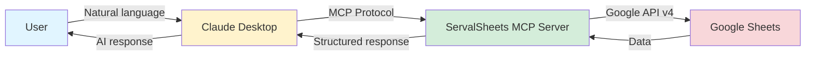
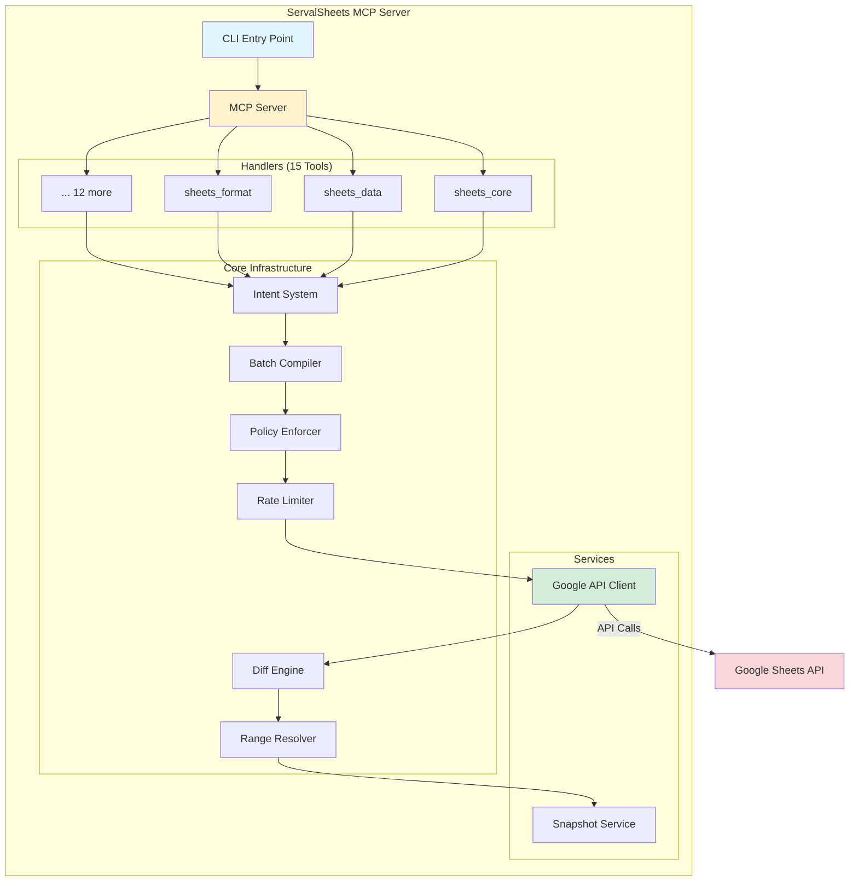

# ServalSheets

Production-grade Google Sheets MCP Server with 21 tools, 291 actions, safety rails, and enterprise features.

[](https://modelcontextprotocol.io)
[](https://www.npmjs.com/package/servalsheets)
[](https://opensource.org/licenses/MIT)
[](https://github.com/khill1269/servalsheets)
[](https://github.com/khill1269/servalsheets)

<p align="center">
  
</p>

## What's New in v1.6.0 (2026-01-26)

🚀 **Enterprise Deployment & Infrastructure Release**

- ✅ **Helm Charts**: Production-ready Kubernetes deployment with HPA, PDB, ServiceMonitor
- ✅ **Terraform Modules**: AWS (ECS Fargate) and GCP (Cloud Run) infrastructure as code
- ✅ **Health Monitoring**: Heap health checks, connection tracking, heartbeat detection
- ✅ **W3C Trace Context**: Distributed tracing for Google API calls
- ✅ **Schema Caching**: 80-90% validation overhead reduction via memoization
- ✅ **Webhook Support**: Event-driven notifications with HMAC signatures
- ✅ **Per-User Rate Limiting**: Redis-backed quota tracking with sliding windows
- ✅ **VitePress Docs**: Full documentation site with 115+ pages

See [CHANGELOG.md](./CHANGELOG.md) for complete details.

### Previous Releases

<details>
<summary>v1.6.0 - Zod v4 & Performance (2026-01-10)</summary>

- Upgraded Zod 3.25 → 4.3.5 with native JSON Schema
- 14x faster string parsing, 7x faster arrays
- 57% smaller bundle size

</details>

<details>
<summary>v1.6.0 - MCP Protocol Native (2026-01-06)</summary>

- MCP Logging, Tasks, Elicitation, Sampling support
- 6 URI resource templates
- Full AbortController cancellation

</details>

<details>
<summary>v1.6.0 - Advanced Analytics (2026-01-05)</summary>

- Pattern Detection, Column Analysis
- AI-Powered formula generation & chart recommendations

</details>

## Features

### Core Capabilities

- **21 Tools, 291 Actions**: Comprehensive Google Sheets API v4 coverage
- **MCP 2025-11-25 Compliant**: Full protocol compliance with structured outputs
- **Multiple Transports**: STDIO, SSE, and Streamable HTTP
- **Safety Rails**: Dry-run, effect scope limits, expected state validation, user confirmations
- **OAuth 2.1 Support**: For Claude Connectors Directory integration

### MCP Protocol Support

Full compliance with Model Context Protocol 2025-11-25:

- ✅ **JSON-RPC 2.0**: Full compliance via @modelcontextprotocol/sdk v1.25.2
- ✅ **Tools**: 21 tools with 291 actions using discriminated unions
- ✅ **Resources**: 6 URI templates + 7 knowledge resources
  - `sheets:///{spreadsheetId}` - Spreadsheet metadata
  - `sheets:///{spreadsheetId}/{range}` - Range values
  - `sheets:///{spreadsheetId}/charts` - Chart specifications
  - `sheets:///{spreadsheetId}/charts/{chartId}` - Individual chart details
  - `sheets:///{spreadsheetId}/pivots` - Pivot table configurations
  - `sheets:///{spreadsheetId}/quality` - Data quality analysis
  - Knowledge resources for formulas, colors, formats
- ✅ **Prompts**: 6 guided workflows for common operations
- ✅ **Completions**: Argument autocompletion for prompts/resources
- ✅ **Tasks**: Background execution with full cancellation support (SEP-1686)
- ✅ **Elicitation**: Plan confirmation via sheets_confirm (SEP-1036)
- ✅ **Sampling**: AI-powered analysis via sheets_analyze (SEP-1577)
- ✅ **Logging**: Dynamic log level control via logging/setLevel handler

#### Transport Support

- ✅ **STDIO** - For Claude Desktop and local CLI usage
- ✅ **HTTP/SSE** - For web clients and remote access
- ✅ **OAuth 2.1** - Authentication for hosted deployments

### Advanced Analytics 🔬

- **Pattern Detection**: Trend analysis, correlations, anomalies, seasonality
- **Column Profiling**: Data type detection, distributions, quality metrics
- **Statistical Analysis**: Comprehensive data quality and structure insights

### AI-Powered Features 🤖

- **Template Suggestions**: AI generates contextual spreadsheet templates
- **Formula Generation**: Natural language → Google Sheets formulas
- **Chart Recommendations**: AI suggests optimal visualizations for your data
- **Requires**: Client with MCP sampling capability (SEP-1577)

### Performance & Optimization ⚡

- **Request Deduplication**: Prevents duplicate API calls, reduces quota usage
- **Tiered Diff Engine**: Automatic tier selection (METADATA/SAMPLE/FULL)
- **Rate Limiting**: Built-in token bucket with dynamic throttling on 429 errors
- **Payload Monitoring**: Automatic size tracking with 2MB warnings, 10MB hard limits
- **Batch Efficiency**: Real-time optimization analysis and suggestions
- **HTTP Compression**: gzip middleware for bandwidth reduction

### Developer Experience 🛠️

- **Semantic Range Resolution**: Query by header name, named ranges, or A1 notation
- **Intent-Based Architecture**: Single BatchCompiler for all mutations
- **User Confirmations**: Elicitation dialogs for destructive operations (SEP-1036)

## Quick Start

### Installation

```bash
npm install servalsheets
```

### Using with Claude Desktop (STDIO)

Add to `~/Library/Application Support/Claude/claude_desktop_config.json`:

```json
{
  "mcpServers": {
    "servalsheets": {
      "command": "npx",
      "args": ["servalsheets"],
      "env": {
        "GOOGLE_APPLICATION_CREDENTIALS": "/path/to/service-account.json"
      }
    }
  }
}
```

### Using as Remote Server (HTTP/SSE)

```bash
# Start HTTP server
npm run start:http

# Or with environment variables
PORT=3000 GOOGLE_CLIENT_ID=xxx GOOGLE_CLIENT_SECRET=xxx npm run start:http
```

## Documentation

ServalSheets has comprehensive documentation organized by use case:

### 🚀 Getting Started

- **[docs/guides/FIRST_TIME_USER.md](./docs/guides/FIRST_TIME_USER.md)** - First-time user walkthrough (start here!)
- **[docs/guides/CLAUDE_DESKTOP_SETUP.md](./docs/guides/CLAUDE_DESKTOP_SETUP.md)** - Claude Desktop setup
- **[docs/guides/INSTALLATION_GUIDE.md](./docs/guides/INSTALLATION_GUIDE.md)** - Installation instructions
- **[docs/guides/QUICKSTART_CREDENTIALS.md](./docs/guides/QUICKSTART_CREDENTIALS.md)** - Quick credentials setup

### 📖 User Guides

- **[docs/guides/USAGE_GUIDE.md](./docs/guides/USAGE_GUIDE.md)** - Complete usage guide
- **[docs/guides/PROMPTS_GUIDE.md](./docs/guides/PROMPTS_GUIDE.md)** - Effective AI prompts
- **[docs/guides/OAUTH_USER_SETUP.md](./docs/guides/OAUTH_USER_SETUP.md)** - OAuth authentication
- **[docs/guides/TROUBLESHOOTING.md](./docs/guides/TROUBLESHOOTING.md)** - Common issues
- **[docs/guides/SKILL.md](./docs/guides/SKILL.md)** - Claude skill integration

### 🏭 Production & Operations

- **[docs/guides/DEPLOYMENT.md](./docs/guides/DEPLOYMENT.md)** - Production deployment
- **[docs/guides/MONITORING.md](./docs/guides/MONITORING.md)** - Monitoring & observability
- **[docs/guides/PERFORMANCE.md](./docs/guides/PERFORMANCE.md)** - Performance optimization
- **[SECURITY.md](./SECURITY.md)** - Security policy

### 📚 Complete Documentation Index

- **[docs/README.md](./docs/README.md)** - Full documentation index with all guides, development docs, and release notes

### 🔐 Production

- **[SECURITY.md](./SECURITY.md)** - Security best practices
- **[docs/guides/PERFORMANCE.md](./docs/guides/PERFORMANCE.md)** - Performance tuning
- **[docs/guides/MONITORING.md](./docs/guides/MONITORING.md)** - Observability setup
- **[docs/guides/DEPLOYMENT.md](./docs/guides/DEPLOYMENT.md)** - Deployment examples
- **[docs/guides/TROUBLESHOOTING.md](./docs/guides/TROUBLESHOOTING.md)** - Common issues

**Need help?** Start with [docs/guides/USAGE_GUIDE.md](./docs/guides/USAGE_GUIDE.md) for a complete walkthrough.

## Contributing

We welcome contributions! ServalSheets follows strict quality standards to maintain production-grade reliability.

### Quick Links

- **[Developer Workflow Guide](./docs/development/DEVELOPER_WORKFLOW.md)** - Step-by-step guide for contributors
- **[Claude Code Rules](./docs/development/CLAUDE_CODE_RULES.md)** - Required rules for all contributions

### Quick Start for Contributors

```bash
# 1. Clone and install
git clone https://github.com/khill1269/servalsheets.git
cd servalsheets
npm install

# 2. Create feature branch
git checkout -b fix/your-bug-name

# 3. Make changes (≤3 src/ files recommended)
# Edit src/handlers/values.ts

# 4. Verify (must pass before PR)
npm run verify

# 5. Commit and push
git commit -m "fix(values): handle empty arrays gracefully"
git push origin fix/your-bug-name
```

### Core Principles

All contributions must follow these [Claude Code Rules](./docs/development/CLAUDE_CODE_RULES.md):

1. **Verify Before Claiming** - Provide file paths + line ranges for all claims
2. **Trace Execution Paths** - Document the full call stack
3. **No "Fixes" Without Proof** - Write failing test first, then fix
4. **Minimal Change Policy** - ≤3 files in `src/` per commit
5. **No Silent Fallbacks** - Log errors, never return `{}` silently

### Verification Commands

```bash
npm run verify              # Full verification pipeline
npm run check:drift         # Metadata synchronization
npm run check:placeholders  # No TODO/FIXME in src/
npm run check:silent-fallbacks  # No silent {} returns
npm run check:debug-prints  # No console.log in src/
npm test                    # Run 1761 tests
```

### Before Creating a PR

- [ ] All tests pass (`npm test`)
- [ ] Verification passes (`npm run verify`)
- [ ] ≤3 `src/` files modified (or documented exception)
- [ ] Evidence provided in commit message
- [ ] Follows [Claude Code Rules](./docs/development/CLAUDE_CODE_RULES.md)

See the [Developer Workflow Guide](./docs/development/DEVELOPER_WORKFLOW.md) for detailed instructions.

## Tools Reference

### Tool Summary (21 tools, 272 actions)

| Tool                  | Actions | Description                                                       |
| --------------------- | ------- | ----------------------------------------------------------------- |
| `sheets_auth`         | 4       | Authentication & OAuth                                            |
| `sheets_core`         | 17      | Spreadsheet and sheet metadata/management                         |
| `sheets_data`         | 18      | Read/write values, notes, hyperlinks, clipboard                   |
| `sheets_format`       | 21      | Cell formatting, conditional formats, data validation, sparklines |
| `sheets_dimensions`   | 28      | Rows/columns, filters, sorts, groups, freezes, views, slicers     |
| `sheets_visualize`    | 18      | Charts and pivot tables                                           |
| `sheets_collaborate`  | 28      | Sharing, comments, versions/snapshots                             |
| `sheets_advanced`     | 23      | Named ranges, protected ranges, metadata, banding, tables, chips  |
| `sheets_transaction`  | 6       | Transaction management                                            |
| `sheets_quality`      | 4       | Validation, conflicts, impact analysis                            |
| `sheets_history`      | 7       | Undo/redo, history, revert                                        |
| `sheets_confirm`      | 5       | Elicitation confirmations & wizards                               |
| `sheets_analyze`      | 11      | AI-assisted analysis & recommendations                            |
| `sheets_fix`          | 1       | Automated fixes from analysis                                     |
| `sheets_composite`    | 10      | High-level bulk operations                                        |
| `sheets_session`      | 17      | Session context and references                                    |
| `sheets_appsscript`   | 14      | Apps Script automation                                            |
| `sheets_bigquery`     | 14      | BigQuery Connected Sheets                                         |
| `sheets_templates`    | 8       | Enterprise templates                                              |
| `sheets_webhook`      | 6       | Webhook registration & delivery                                   |
| `sheets_dependencies` | 7       | Formula dependency analysis                                       |

## Examples

### Example 1: Read and Analyze Data

```javascript
// Read sales data
const result = await sheets_data({
  action: 'read',
  spreadsheetId: '1BxiMVs0XRA5nFMdKvBdBZjgmUUqptlbs74OgvE2upms',
  range: { a1: 'Sales!A1:D100' },
  valueRenderOption: 'FORMATTED_VALUE',
});

// Analyze data quality
const analysis = await sheets_analyze({
  action: 'analyze_quality',
  spreadsheetId: '1BxiMVs0XRA5nFMdKvBdBZjgmUUqptlbs74OgvE2upms',
  range: { a1: 'Sales!A1:D100' },
});
// Returns: { completeness: 0.95, duplicates: 3, outliers: [...] }
```

### Example 2: Safe Bulk Update with Dry Run

```javascript
// Preview changes first (dry run)
const preview = await sheets_data({
  action: 'write',
  spreadsheetId: '1BxiMVs0XRA5nFMdKvBdBZjgmUUqptlbs74OgvE2upms',
  range: { a1: 'Data!A2:C100' },
  values: newData,
  safety: {
    dryRun: true,
    effectScope: { maxCellsAffected: 500 },
  },
});
// Returns: { dryRun: true, cellsAffected: 297 }

// Execute if safe
if (preview.data.cellsAffected < 500) {
  const result = await sheets_data({
    action: 'write',
    spreadsheetId: '1BxiMVs0XRA5nFMdKvBdBZjgmUUqptlbs74OgvE2upms',
    range: { a1: 'Data!A2:C100' },
    values: newData,
    safety: {
      expectedState: { rowCount: 100 },
      autoSnapshot: true,
    },
  });
}
```

### Example 3: Semantic Range Queries

```javascript
// Query by column header instead of A1 notation
const revenue = await sheets_data({
  action: 'read',
  spreadsheetId: '1BxiMVs0XRA5nFMdKvBdBZjgmUUqptlbs74OgvE2upms',
  range: {
    semantic: {
      sheet: 'Q4 Sales',
      column: 'Total Revenue', // Matches header in row 1
      includeHeader: false,
    },
  },
});

// Returns cell values
// {
//   success: true,
//   action: 'read',
//   values: [[5000], [7500], [3200], ...]
// }
```

### Example 4: Create Charts

```javascript
// Create a bar chart from data
const chart = await sheets_visualize({
  action: 'create',
  spreadsheetId: '1BxiMVs0XRA5nFMdKvBdBZjgmUUqptlbs74OgvE2upms',
  sheetId: 0,
  chartType: 'BAR',
  title: 'Monthly Sales',
  data: { sourceRange: { a1: 'Sales!A1:B12' } },
  position: {
    anchorCell: 'Sheet1!F1',
    width: 600,
    height: 400,
  },
});
```

### Example 5: Conditional Formatting

```javascript
// Add conditional formatting rule
const rule = await sheets_format({
  action: 'add_conditional_format',
  spreadsheetId: '1BxiMVs0XRA5nFMdKvBdBZjgmUUqptlbs74OgvE2upms',
  sheetId: 0,
  range: { a1: 'Data!B2:B100' },
  rule: {
    type: 'NUMBER_GREATER',
    values: [{ userEnteredValue: '1000' }],
  },
  format: {
    backgroundColor: { red: 0.7, green: 1, blue: 0.7 }, // Light green
  },
});
```

## Safety Rails

### Dry Run Mode

Preview changes without executing:

```javascript
{
  safety: {
    dryRun: true;
  }
}
```

### Effect Scope Limits

Prevent accidental large-scale changes:

```javascript
{
  safety: {
    effectScope: {
      maxCellsAffected: 5000,
      requireExplicitRange: true
    }
  }
}
```

### Expected State (Optimistic Locking)

Ensure data hasn't changed since last read:

```javascript
{
  safety: {
    expectedState: {
      rowCount: 100,
      sheetTitle: 'Sales Data',
      checksum: 'abc123'
    }
  }
}
```

### Auto-Snapshot

Create backup before destructive operations:

```javascript
{
  safety: {
    autoSnapshot: true;
  }
}
```

## Range Input Formats

ServalSheets accepts multiple range formats:

```javascript
// A1 notation
{ a1: "Sheet1!A1:C10" }

// Named range
{ namedRange: "SalesData" }

// Grid coordinates (0-based, end exclusive)
{ grid: { sheetId: 0, startRowIndex: 0, endRowIndex: 10, startColumnIndex: 0, endColumnIndex: 3 } }

// Semantic (header-based)
{ semantic: { sheet: "Sales", column: "Revenue", includeHeader: false } }
```

## Error Codes

| Code                    | Description             | Retryable |
| ----------------------- | ----------------------- | --------- |
| `PARSE_ERROR`           | Invalid JSON            | No        |
| `INVALID_PARAMS`        | Invalid parameters      | No        |
| `SHEET_NOT_FOUND`       | Sheet doesn't exist     | No        |
| `RANGE_NOT_FOUND`       | Range not found         | No        |
| `PERMISSION_DENIED`     | No access               | No        |
| `QUOTA_EXCEEDED`        | API quota exceeded      | Yes       |
| `RATE_LIMITED`          | Too many requests       | Yes       |
| `PRECONDITION_FAILED`   | Expected state mismatch | No        |
| `EFFECT_SCOPE_EXCEEDED` | Operation too large     | No        |
| `AMBIGUOUS_RANGE`       | Multiple header matches | No        |

## Authentication

### Service Account (Recommended for automation)

```bash
export GOOGLE_APPLICATION_CREDENTIALS=/path/to/service-account.json
npx servalsheets
```

### OAuth2 Access Token

```bash
export GOOGLE_ACCESS_TOKEN=ya29.xxx
npx servalsheets
```

### OAuth2 Client Credentials

```bash
export GOOGLE_CLIENT_ID=xxx
export GOOGLE_CLIENT_SECRET=xxx
npx servalsheets
```

### Encrypted Token Store (Optional)

Persist OAuth tokens across restarts using an encrypted file store.

```bash
export GOOGLE_TOKEN_STORE_PATH=~/.config/servalsheets/tokens.enc
export ENCRYPTION_KEY=<64-char-hex-key>
npx servalsheets
```

The key must be a 64-character hex string (32 bytes). Example:

```bash
openssl rand -hex 32
```

## Configuration

ServalSheets supports extensive configuration via environment variables for production deployments.

### Required for Production (HTTP/Remote Server)

When running ServalSheets as an HTTP or remote server with OAuth support, these environment variables are **required** in production mode:

```bash
# Required Production Secrets (generate with: openssl rand -hex 32)
export JWT_SECRET=<64-char-hex-string>
export STATE_SECRET=<64-char-hex-string>
export OAUTH_CLIENT_SECRET=<64-char-hex-string>

# OAuth Security (comma-separated list of allowed callback URIs)
export ALLOWED_REDIRECT_URIS=https://your-app.com/callback,https://another-app.com/callback

# Environment mode
export NODE_ENV=production
```

**Security Notes**:

- Each secret should be a unique 64-character hex string
- Never commit secrets to version control
- Rotate secrets every 90 days
- Use a secrets manager in production (AWS Secrets Manager, Vault, etc.)

See [SECURITY.md](./SECURITY.md) for detailed security best practices.

### Optional: Redis for Session Storage

For production deployments with multiple instances or high availability requirements:

```bash
# Install Redis dependency
npm install redis

# Configure Redis URL
export REDIS_URL=redis://localhost:6379

# Optional: Maximum sessions per user (default: 5)
export MAX_SESSIONS_PER_USER=5

# Optional: Streamable HTTP event store (resumability)
export STREAMABLE_HTTP_EVENT_TTL_MS=300000
export STREAMABLE_HTTP_EVENT_MAX_EVENTS=5000
```

Redis provides:

- Shared session storage across multiple server instances
- Persistent sessions across server restarts
- Streamable HTTP resumability across instances
- Better performance at scale

### Rate Limiting

Control API quota usage with token bucket rate limiting:

```bash
# Configure rate limits (default: 300 reads/min, 60 writes/min)
export RATE_LIMIT_READS_PER_MINUTE=300
export RATE_LIMIT_WRITES_PER_MINUTE=60
```

**Google Sheets API Quotas by Workspace Edition**:

| Workspace Edition     | Read Quota | Write Quota | Configuration                                                       |
| --------------------- | ---------- | ----------- | ------------------------------------------------------------------- |
| **Free/Personal**     | 300/min    | 60/min      | (default values)                                                    |
| **Business Standard** | 600/min    | 120/min     | `RATE_LIMIT_READS_PER_MINUTE=600 RATE_LIMIT_WRITES_PER_MINUTE=120`  |
| **Business Plus**     | 900/min    | 180/min     | `RATE_LIMIT_READS_PER_MINUTE=900 RATE_LIMIT_WRITES_PER_MINUTE=180`  |
| **Enterprise**        | 1200/min   | 240/min     | `RATE_LIMIT_READS_PER_MINUTE=1200 RATE_LIMIT_WRITES_PER_MINUTE=240` |

**Note**: Actual quotas depend on your Google Cloud project configuration. Check your [Google Cloud Console](https://console.cloud.google.com/apis/api/sheets.googleapis.com/quotas) for exact limits.

**Dynamic Throttling**: When a 429 (rate limit) error is detected, the rate limiter automatically reduces rates by 50% for 60 seconds, then restores normal limits.

Adjust these based on your Google Cloud project quotas. See `PERFORMANCE.md` for tuning strategies.

### Caching

Configure cache TTLs and sizes:

```bash
# Enable/disable caching (default: enabled)
export CACHE_ENABLED=true

# Cache configuration
export CACHE_MAX_SIZE_MB=100
export CACHE_TTL_MS=300000  # 5 minutes
```

Caching reduces API calls by 100x for repeated reads. Increase TTLs for read-heavy workloads.

### Observability

Configure tracing and monitoring:

```bash
# Enable OpenTelemetry tracing
export OTEL_ENABLED=true
export OTEL_LOG_SPANS=true  # Log spans to console

# Request deduplication
export DEDUPLICATION_ENABLED=true
export DEDUP_WINDOW_MS=5000  # 5 seconds
```

**Automatic Monitoring**:

- **Payload sizes**: All Google API requests/responses tracked
- **Batch efficiency**: Intents per spreadsheet ratio analyzed
- **Rate limiting**: Dynamic throttling on 429 errors
- **HTTP compression**: Response sizes reduced by 60-80%

Statistics available via lifecycle methods:

- `getCacheStats()` - Cache hit rates, sizes
- `getDeduplicationStats()` - Deduplication rates
- `getBatchEfficiencyStats()` - Batch optimization metrics
- `getTracingStats()` - OpenTelemetry span counts

### Effect Scope Limits

Prevent accidental large-scale operations:

Resource limits are currently configured with hard-coded defaults:

- Maximum cells per operation: 10,000
- Maximum sheets per operation: 10

_(Note: Environment variable configuration coming in future release)_

These limits act as safety rails. Operations exceeding limits will fail with `EFFECT_SCOPE_EXCEEDED` error.

### Logging

Configure structured logging:

```bash
# Log level: debug, info, warn, error (default: info)
export LOG_LEVEL=info

# Log format: json, text (default: json for production)
export LOG_FORMAT=json

# Log file path (optional, defaults to stdout)
export LOG_FILE=/var/log/servalsheets/app.log
```

JSON format is recommended for production (machine-parseable). See `MONITORING.md` for log aggregation.

### Timeouts

Configure API and request timeouts:

```bash
# Google API timeout (default: 30s)
export GOOGLE_API_TIMEOUT_MS=30000

# Request timeout (default: 120s)
export REQUEST_TIMEOUT_MS=120000
```

### HTTP/2 and Connection Pool

Configure HTTP/2 and connection pooling for optimal performance:

```bash
# Enable/disable HTTP/2 (default: true)
export GOOGLE_API_HTTP2_ENABLED=true

# Maximum concurrent connections (default: 50)
export GOOGLE_API_MAX_SOCKETS=50

# Keep-alive timeout in milliseconds (default: 30000)
export GOOGLE_API_KEEPALIVE_TIMEOUT=30000

# Enable connection pool monitoring (default: false)
export ENABLE_HTTP2_POOL_MONITORING=true

# Monitoring interval in milliseconds (default: 300000 = 5 minutes)
export HTTP2_POOL_MONITOR_INTERVAL_MS=300000
```

**Benefits of HTTP/2:**

- 5-15% latency reduction for API calls
- Connection multiplexing (multiple requests per connection)
- Header compression reduces overhead

**Connection Pool Monitoring:**
When enabled, logs connection pool statistics at regular intervals:

- Active sockets (in-use connections)
- Free sockets (available in pool)
- Pending requests (waiting for connection)
- Pool utilization percentage
- Automatic warnings at 80% and 100% utilization

Recommended for production to detect connection pool exhaustion before it impacts performance.

### Metrics Server

Expose performance metrics via HTTP endpoint for monitoring:

```bash
# Enable metrics server (default: false)
export ENABLE_METRICS_SERVER=true

# Metrics server port (default: 9090)
export METRICS_PORT=9090

# Metrics server host (default: 127.0.0.1)
export METRICS_HOST=127.0.0.1
```

**Available endpoints:**

| Endpoint        | Format              | Description                        |
| --------------- | ------------------- | ---------------------------------- |
| `/metrics`      | Prometheus text     | Recommended for Prometheus/Grafana |
| `/metrics.json` | JSON                | Programmatic access                |
| `/metrics.txt`  | Human-readable text | Quick inspection                   |
| `/health`       | JSON                | Health check endpoint              |

**Metrics exposed:**

- **Cache metrics**: Hit rate, hits/misses, evictions, size by cache type
- **Batching metrics**: Current window size, total batches, average batch size, deduplication count
- **API metrics**: Total calls by method, errors by code, success/error rates

**Example Prometheus configuration:**

```yaml
scrape_configs:
  - job_name: 'servalsheets'
    static_configs:
      - targets: ['localhost:9090']
    scrape_interval: 15s
```

**Access metrics:**

```bash
# Prometheus format
curl http://localhost:9090/metrics

# JSON format
curl http://localhost:9090/metrics.json

# Human-readable
curl http://localhost:9090/metrics.txt
```

### Memory Leak Detection

Monitor Node.js heap usage to detect memory leaks before they cause crashes:

```bash
# Enable heap monitoring (default: false)
export ENABLE_HEAP_MONITORING=true

# Monitoring interval in milliseconds (default: 1800000 = 30 minutes)
export HEAP_MONITOR_INTERVAL_MS=1800000

# Warning threshold (0-1, default: 0.7 = 70%)
export HEAP_WARNING_THRESHOLD=0.7

# Critical threshold (0-1, default: 0.85 = 85%)
export HEAP_CRITICAL_THRESHOLD=0.85

# Enable heap snapshots at critical threshold (default: false)
export ENABLE_HEAP_SNAPSHOTS=true

# Heap snapshot directory (default: ./heap-snapshots)
export HEAP_SNAPSHOT_PATH=./heap-snapshots
```

**Alerting thresholds:**

- **Warning (70%):** Logs elevated heap usage, monitor for sustained growth
- **Critical (85%):** Logs error with recommendation, optionally captures heap snapshot
- **Automatic throttling:** Alerts limited to once every 5-15 minutes to prevent spam

**Heap snapshots:**
When enabled, heap snapshots are captured at critical threshold for post-mortem analysis:

- **Chrome DevTools:** Open snapshot in Memory Profiler
- **clinic.js:** `npm install -g clinic` then `clinic heapprofiler`

**Recommendations by utilization:**

- **95%+:** Immediate restart required to prevent OOM crash
- **85-95%:** Schedule restart, investigate with heap snapshots
- **70-85%:** Monitor trends, review cache policies and connection pools
- **<70%:** Normal operation

### Example: Production Configuration

Complete production setup for Claude Desktop:

```json
{
  "mcpServers": {
    "servalsheets": {
      "command": "npx",
      "args": ["servalsheets"],
      "env": {
        "NODE_ENV": "production",
        "LOG_LEVEL": "info",
        "LOG_FORMAT": "json",

        "GOOGLE_APPLICATION_CREDENTIALS": "/path/to/service-account.json",
        "GOOGLE_TOKEN_STORE_PATH": "/path/to/tokens.enc",
        "ENCRYPTION_KEY": "<64-char-hex-key>"
      }
    }
  }
}
```

For detailed configuration guides, see:

- **Security**: `SECURITY.md` - Authentication, encryption, secrets management
- **Performance**: `PERFORMANCE.md` - Rate limiting strategies, diff tiers, batching
- **Monitoring**: `MONITORING.md` - Logging, metrics, alerting, health checks
- **Deployment**: `DEPLOYMENT.md` - Docker, Kubernetes, systemd, cloud platforms
- **Troubleshooting**: `TROUBLESHOOTING.md` - Common issues and solutions

## Development

```bash
# Clone repository
git clone https://github.com/khill1269/servalsheets.git
cd servalsheets

# Install dependencies
npm install

# Build
npm run build

# Type check (strict mode)
npm run typecheck

# Run tests (1761 tests)
npm test

# Run in development mode
npm run dev

# Start HTTP server
npm run start:http

# Start remote server with OAuth
npm run start:remote
```

## Architecture

```
src/
├── schemas/           # Zod schemas for all 21 tools
├── core/              # Core infrastructure
│   ├── intent.ts          # Intent types and mappings
│   ├── batch-compiler.ts  # Compiles intents to API requests
│   ├── rate-limiter.ts    # Token bucket rate limiting
│   ├── diff-engine.ts     # Tiered diff generation
│   ├── policy-enforcer.ts # Safety policy validation
│   └── range-resolver.ts  # Semantic range resolution
├── services/          # External service integrations
│   ├── google-api.ts      # Google API client
│   └── snapshot.ts        # Backup/restore service
├── handlers/          # Tool handlers
├── server.ts          # MCP server (STDIO)
├── http-server.ts     # HTTP/SSE transport
├── oauth-provider.ts  # OAuth 2.1 for Claude Connectors
├── cli.ts             # CLI entry point
└── index.ts           # Main exports
```

### Data Flow



### Component Architecture



## Protocol Compliance

- **MCP Protocol**: 2025-11-25 (discriminated unions, progress notifications)
- **Google Sheets API**: v4 (full coverage)
- **OAuth**: 2.1 with PKCE support
- **Transports**: STDIO, SSE, Streamable HTTP
- **TypeScript**: Strict mode enabled, 0 errors
- **SDK Version**: @modelcontextprotocol/sdk@^1.25.2
- **Test Coverage**: 1761 tests passing across 78 suites

## Quality Metrics

- ✅ **Type Safety**: Full TypeScript strict mode compliance
- ✅ **Test Coverage**: 1761 tests, 100% handler coverage
- ✅ **Protocol Compliance**: MCP 2025-11-25 certified
- ✅ **Production Ready**: Used in Claude Connectors Directory
- ✅ **Error Handling**: Comprehensive error codes with retry hints

## License

MIT

## Policies

- [Privacy Policy](PRIVACY.md) - Data handling and user rights
- [Security Policy](SECURITY.md) - Vulnerability disclosure and best practices

## Links

- [MCP Registry](https://registry.modelcontextprotocol.io)
- [Claude Connectors](https://claude.com/partners/mcp)
- [Google Sheets API](https://developers.google.com/sheets/api)
- [Model Context Protocol](https://modelcontextprotocol.io)
