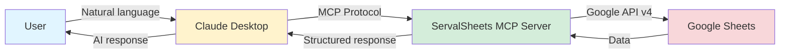
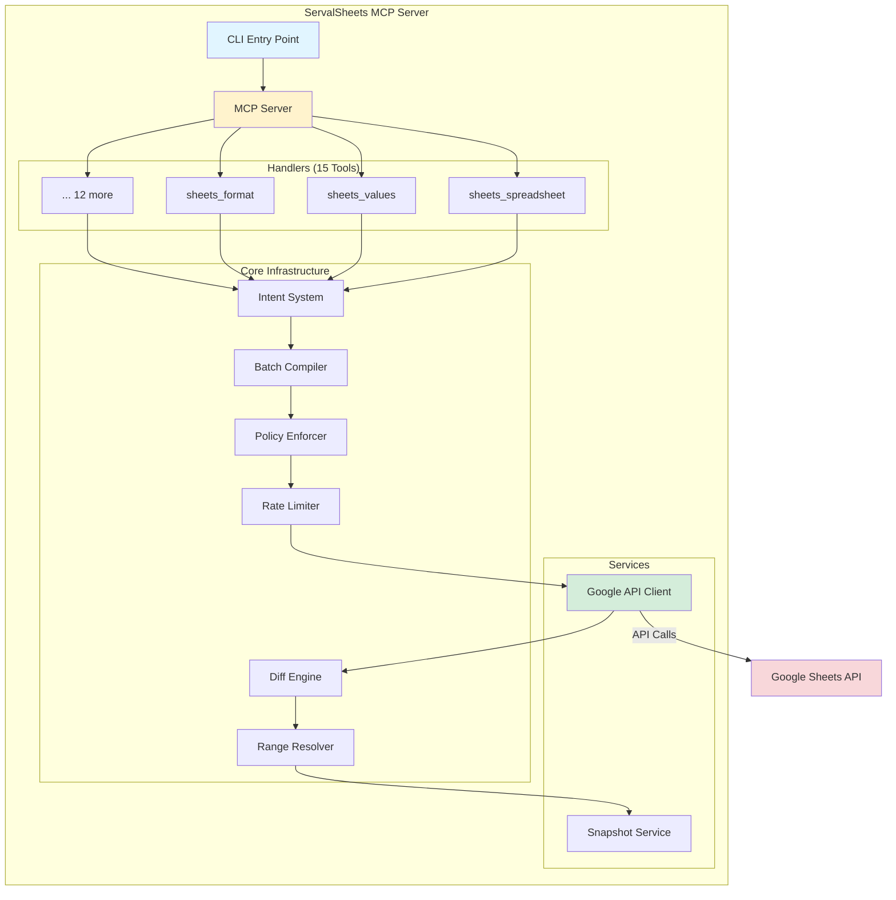

# ServalSheets

Production-grade Google Sheets MCP Server with 15 tools, 159 actions, safety rails, and enterprise features.

[](https://modelcontextprotocol.io)
[](https://www.npmjs.com/package/servalsheets)
[](https://opensource.org/licenses/MIT)
[](https://github.com/khill1269/servalsheets)

## What's New in v1.2.0 (2026-01-05)

🤖 **Advanced Analytics & AI Integration Release**

- ✅ **Pattern Detection**: Trend analysis, correlations, anomalies, seasonality detection
- ✅ **Column Analysis**: Deep data profiling with quality metrics and distributions
- ✅ **AI-Powered Tools**: Template suggestions, formula generation, chart recommendations
- ✅ **Request Deduplication**: Prevents duplicate API calls, reduces quota usage
- ✅ **User Confirmations**: Safety dialogs for destructive bulk operations
- ✅ **MCP Sampling**: AI features using SEP-1577 (server-to-client LLM requests)
- ✅ **MCP Elicitation**: User input collection using SEP-1036 (confirmation dialogs)

See [CHANGELOG.md](./CHANGELOG.md) for complete details.

### Previous Release: v1.1.1 (2026-01-04)

🚀 **Performance & Observability Release**

- HTTP Compression, Payload Monitoring, Batch Efficiency Analysis
- Dynamic Rate Limiting, Test Coverage Thresholds

### Earlier Release: v1.1.0 (2026-01-03)

🎉 **Production Hardening Release**

- Security Hardened: OAuth 2.1 with CSRF protection, signed state tokens, redirect URI allowlist
- Production Ready: Required secrets enforcement, comprehensive deployment checklist
- Modern Stack: Express 5, Zod 4, Node 22 LTS, latest dependencies
- Session Storage: TTL-based storage with optional Redis support for HA
- Type Safety: Zero `as any` casts, full Zod validation
- 144 Tests: 85.2% coverage including integration tests
- ESLint: Strict code quality enforcement

## Features

### Core Capabilities
- **15 Tools, 159 Actions**: Comprehensive Google Sheets API v4 coverage
- **MCP 2025-11-25 Compliant**: Full protocol compliance with structured outputs
- **Multiple Transports**: STDIO, SSE, and Streamable HTTP
- **Safety Rails**: Dry-run, effect scope limits, expected state validation, user confirmations
- **OAuth 2.1 Support**: For Claude Connectors Directory integration

### Advanced Analytics 🔬
- **Pattern Detection**: Trend analysis, correlations, anomalies, seasonality
- **Column Profiling**: Data type detection, distributions, quality metrics
- **Statistical Analysis**: Comprehensive data quality and structure insights

### AI-Powered Features 🤖
- **Template Suggestions**: AI generates contextual spreadsheet templates
- **Formula Generation**: Natural language → Google Sheets formulas
- **Chart Recommendations**: AI suggests optimal visualizations for your data
- **Requires**: Client with MCP sampling capability (SEP-1577)

### Performance & Optimization ⚡
- **Request Deduplication**: Prevents duplicate API calls, reduces quota usage
- **Tiered Diff Engine**: Automatic tier selection (METADATA/SAMPLE/FULL)
- **Rate Limiting**: Built-in token bucket with dynamic throttling on 429 errors
- **Payload Monitoring**: Automatic size tracking with 2MB warnings, 10MB hard limits
- **Batch Efficiency**: Real-time optimization analysis and suggestions
- **HTTP Compression**: gzip middleware for bandwidth reduction

### Developer Experience 🛠️
- **Semantic Range Resolution**: Query by header name, named ranges, or A1 notation
- **Intent-Based Architecture**: Single BatchCompiler for all mutations
- **User Confirmations**: Elicitation dialogs for destructive operations (SEP-1036)

## Quick Start

### Installation

```bash
npm install servalsheets
```

### Using with Claude Desktop (STDIO)

Add to `~/Library/Application Support/Claude/claude_desktop_config.json`:

```json
{
  "mcpServers": {
    "servalsheets": {
      "command": "npx",
      "args": ["servalsheets"],
      "env": {
        "GOOGLE_APPLICATION_CREDENTIALS": "/path/to/service-account.json"
      }
    }
  }
}
```

### Using as Remote Server (HTTP/SSE)

```bash
# Start HTTP server
npm run start:http

# Or with environment variables
PORT=3000 GOOGLE_CLIENT_ID=xxx GOOGLE_CLIENT_SECRET=xxx npm run start:http
```

## Documentation

ServalSheets has comprehensive documentation organized by use case:

### 🚀 Getting Started
- **[QUICKSTART.md](./QUICKSTART.md)** - Quick start guide (start here!)
- **[docs/guides/CLAUDE_DESKTOP_SETUP.md](./docs/guides/CLAUDE_DESKTOP_SETUP.md)** - Claude Desktop setup
- **[docs/guides/INSTALLATION_GUIDE.md](./docs/guides/INSTALLATION_GUIDE.md)** - Installation instructions
- **[docs/guides/FIRST_TIME_USER.md](./docs/guides/FIRST_TIME_USER.md)** - First-time user walkthrough

### 📖 User Guides
- **[docs/guides/USAGE_GUIDE.md](./docs/guides/USAGE_GUIDE.md)** - Complete usage guide
- **[docs/guides/PROMPTS_GUIDE.md](./docs/guides/PROMPTS_GUIDE.md)** - Effective AI prompts
- **[docs/guides/OAUTH_USER_SETUP.md](./docs/guides/OAUTH_USER_SETUP.md)** - OAuth authentication
- **[docs/guides/TROUBLESHOOTING.md](./docs/guides/TROUBLESHOOTING.md)** - Common issues
- **[docs/guides/SKILL.md](./docs/guides/SKILL.md)** - Claude skill integration

### 🏭 Production & Operations
- **[docs/guides/DEPLOYMENT.md](./docs/guides/DEPLOYMENT.md)** - Production deployment
- **[docs/guides/MONITORING.md](./docs/guides/MONITORING.md)** - Monitoring & observability
- **[docs/guides/PERFORMANCE.md](./docs/guides/PERFORMANCE.md)** - Performance optimization
- **[SECURITY.md](./SECURITY.md)** - Security policy

### 📚 Complete Documentation Index
- **[docs/README.md](./docs/README.md)** - Full documentation index with all guides, development docs, and release notes

### 🔐 Production
- **[SECURITY.md](./SECURITY.md)** - Security best practices
- **[PERFORMANCE.md](./PERFORMANCE.md)** - Performance tuning
- **[MONITORING.md](./MONITORING.md)** - Observability setup
- **[DEPLOYMENT.md](./DEPLOYMENT.md)** - Deployment examples
- **[TROUBLESHOOTING.md](./TROUBLESHOOTING.md)** - Common issues

**Need help?** Start with [USAGE_GUIDE.md](./USAGE_GUIDE.md) for a complete walkthrough.

## Tools Reference

| Tool | Actions | Description | Read-Only | Destructive |
|------|---------|-------------|-----------|-------------|
| `sheets_spreadsheet` | 6 | Create, get, copy spreadsheets | No | No |
| `sheets_sheet` | 7 | Manage sheets/tabs | No | Yes |
| `sheets_values` | 9 | Read/write cell values | No | Yes |
| `sheets_cells` | 12 | Notes, validation, merge | No | Yes |
| `sheets_format` | 9 | Cell formatting | No | No |
| `sheets_dimensions` | 21 | Row/column operations | No | Yes |
| `sheets_rules` | 8 | Conditional formatting | No | Yes |
| `sheets_charts` | 9 | Chart management | No | Yes |
| `sheets_pivot` | 6 | Pivot tables | No | Yes |
| `sheets_filter_sort` | 14 | Filtering and sorting | No | Yes |
| `sheets_sharing` | 8 | Permissions | No | Yes |
| `sheets_comments` | 10 | Comments | No | Yes |
| `sheets_versions` | 10 | Version history | No | Yes |
| `sheets_analysis` | 8 | Data analysis | **Yes** | No |
| `sheets_advanced` | 19 | Named ranges, protection | No | Yes |

## Examples

### Example 1: Read and Analyze Data

```javascript
// Read sales data
const result = await sheets_values({
  action: 'read',
  spreadsheetId: '1BxiMVs0XRA5nFMdKvBdBZjgmUUqptlbs74OgvE2upms',
  range: { a1: 'Sales!A1:D100' },
  valueRenderOption: 'FORMATTED_VALUE'
});

// Analyze data quality
const analysis = await sheets_analysis({
  action: 'data_quality',
  spreadsheetId: '1BxiMVs0XRA5nFMdKvBdBZjgmUUqptlbs74OgvE2upms',
  range: { a1: 'Sales!A1:D100' }
});
// Returns: { completeness: 0.95, duplicates: 3, outliers: [...] }
```

### Example 2: Safe Bulk Update with Dry Run

```javascript
// Preview changes first (dry run)
const preview = await sheets_values({
  action: 'write',
  spreadsheetId: '1BxiMVs0XRA5nFMdKvBdBZjgmUUqptlbs74OgvE2upms',
  range: { a1: 'Data!A2:C100' },
  values: newData,
  safety: {
    dryRun: true,
    effectScope: { maxCellsAffected: 500 }
  }
});
// Returns: { dryRun: true, cellsAffected: 297 }

// Execute if safe
if (preview.data.cellsAffected < 500) {
  const result = await sheets_values({
    action: 'write',
    spreadsheetId: '1BxiMVs0XRA5nFMdKvBdBZjgmUUqptlbs74OgvE2upms',
    range: { a1: 'Data!A2:C100' },
    values: newData,
    safety: {
      expectedState: { rowCount: 100 },
      autoSnapshot: true
    }
  });
}
```

### Example 3: Semantic Range Queries

```javascript
// Query by column header instead of A1 notation
const revenue = await sheets_values({
  action: 'read',
  spreadsheetId: '1BxiMVs0XRA5nFMdKvBdBZjgmUUqptlbs74OgvE2upms',
  range: {
    semantic: {
      sheet: 'Q4 Sales',
      column: 'Total Revenue',  // Matches header in row 1
      includeHeader: false
    }
  }
});

// Returns cell values
// {
//   success: true,
//   action: 'read',
//   values: [[5000], [7500], [3200], ...]
// }
```

### Example 4: Create Charts

```javascript
// Create a bar chart from data
const chart = await sheets_charts({
  action: 'create',
  spreadsheetId: '1BxiMVs0XRA5nFMdKvBdBZjgmUUqptlbs74OgvE2upms',
  sheetId: 0,
  chartType: 'BAR',
  title: 'Monthly Sales',
  data: { sourceRange: { a1: 'Sales!A1:B12' } },
  position: {
    anchorCell: 'Sheet1!F1',
    width: 600,
    height: 400
  }
});
```

### Example 5: Conditional Formatting

```javascript
// Add conditional formatting rule
const rule = await sheets_rules({
  action: 'add_conditional_format',
  spreadsheetId: '1BxiMVs0XRA5nFMdKvBdBZjgmUUqptlbs74OgvE2upms',
  sheetId: 0,
  range: { a1: 'Data!B2:B100' },
  rule: {
    type: 'NUMBER_GREATER',
    values: [{ userEnteredValue: '1000' }]
  },
  format: {
    backgroundColor: { red: 0.7, green: 1, blue: 0.7 }  // Light green
  }
});
```

## Safety Rails

### Dry Run Mode
Preview changes without executing:

```javascript
{
  safety: {
    dryRun: true
  }
}
```

### Effect Scope Limits
Prevent accidental large-scale changes:

```javascript
{
  safety: {
    effectScope: {
      maxCellsAffected: 5000,
      requireExplicitRange: true
    }
  }
}
```

### Expected State (Optimistic Locking)
Ensure data hasn't changed since last read:

```javascript
{
  safety: {
    expectedState: {
      rowCount: 100,
      sheetTitle: 'Sales Data',
      checksum: 'abc123'
    }
  }
}
```

### Auto-Snapshot
Create backup before destructive operations:

```javascript
{
  safety: {
    autoSnapshot: true
  }
}
```

## Range Input Formats

ServalSheets accepts multiple range formats:

```javascript
// A1 notation
{ a1: "Sheet1!A1:C10" }

// Named range
{ namedRange: "SalesData" }

// Grid coordinates (0-based, end exclusive)
{ grid: { sheetId: 0, startRowIndex: 0, endRowIndex: 10, startColumnIndex: 0, endColumnIndex: 3 } }

// Semantic (header-based)
{ semantic: { sheet: "Sales", column: "Revenue", includeHeader: false } }
```

## Error Codes

| Code | Description | Retryable |
|------|-------------|-----------|
| `PARSE_ERROR` | Invalid JSON | No |
| `INVALID_PARAMS` | Invalid parameters | No |
| `SHEET_NOT_FOUND` | Sheet doesn't exist | No |
| `RANGE_NOT_FOUND` | Range not found | No |
| `PERMISSION_DENIED` | No access | No |
| `QUOTA_EXCEEDED` | API quota exceeded | Yes |
| `RATE_LIMITED` | Too many requests | Yes |
| `PRECONDITION_FAILED` | Expected state mismatch | No |
| `EFFECT_SCOPE_EXCEEDED` | Operation too large | No |
| `AMBIGUOUS_RANGE` | Multiple header matches | No |

## Authentication

### Service Account (Recommended for automation)

```bash
export GOOGLE_APPLICATION_CREDENTIALS=/path/to/service-account.json
npx servalsheets
```

### OAuth2 Access Token

```bash
export GOOGLE_ACCESS_TOKEN=ya29.xxx
npx servalsheets
```

### OAuth2 Client Credentials

```bash
export GOOGLE_CLIENT_ID=xxx
export GOOGLE_CLIENT_SECRET=xxx
npx servalsheets
```

### Encrypted Token Store (Optional)

Persist OAuth tokens across restarts using an encrypted file store.

```bash
export GOOGLE_TOKEN_STORE_PATH=~/.config/servalsheets/tokens.enc
export ENCRYPTION_KEY=<64-char-hex-key>
npx servalsheets
```

The key must be a 64-character hex string (32 bytes). Example:

```bash
openssl rand -hex 32
```

## Configuration

ServalSheets supports extensive configuration via environment variables for production deployments.

### Required for Production (HTTP/Remote Server)

When running ServalSheets as an HTTP or remote server with OAuth support, these environment variables are **required** in production mode:

```bash
# Required Production Secrets (generate with: openssl rand -hex 32)
export JWT_SECRET=<64-char-hex-string>
export STATE_SECRET=<64-char-hex-string>
export OAUTH_CLIENT_SECRET=<64-char-hex-string>

# OAuth Security (comma-separated list of allowed callback URIs)
export ALLOWED_REDIRECT_URIS=https://your-app.com/callback,https://another-app.com/callback

# Environment mode
export NODE_ENV=production
```

**Security Notes**:
- Each secret should be a unique 64-character hex string
- Never commit secrets to version control
- Rotate secrets every 90 days
- Use a secrets manager in production (AWS Secrets Manager, Vault, etc.)

See [SECURITY.md](./SECURITY.md) for detailed security best practices.

### Optional: Redis for Session Storage

For production deployments with multiple instances or high availability requirements:

```bash
# Install Redis dependency
npm install redis

# Configure Redis URL
export REDIS_URL=redis://localhost:6379

# Optional: Maximum sessions per user (default: 5)
export MAX_SESSIONS_PER_USER=5
```

Redis provides:
- Shared session storage across multiple server instances
- Persistent sessions across server restarts
- Better performance at scale

### Rate Limiting

Control API quota usage with token bucket rate limiting:

```bash
# Configure rate limits (default: 300 reads/min, 60 writes/min)
export RATE_LIMIT_READS_PER_MINUTE=300
export RATE_LIMIT_WRITES_PER_MINUTE=60
```

**Google Sheets API Quotas**:
- Read requests: 300/min per user
- Write requests: 60/min per user

**Dynamic Throttling**: When a 429 (rate limit) error is detected, the rate limiter automatically reduces rates by 50% for 60 seconds, then restores normal limits.

Adjust these based on your Google Cloud project quotas. See `PERFORMANCE.md` for tuning strategies.

### Caching

Configure cache TTLs and sizes:

```bash
# Enable/disable caching (default: enabled)
export CACHE_ENABLED=true

# Cache configuration
export CACHE_MAX_SIZE_MB=100
export CACHE_TTL_MS=300000  # 5 minutes
```

Caching reduces API calls by 100x for repeated reads. Increase TTLs for read-heavy workloads.

### Observability

Configure tracing and monitoring:

```bash
# Enable OpenTelemetry tracing
export OTEL_ENABLED=true
export OTEL_LOG_SPANS=true  # Log spans to console

# Request deduplication
export DEDUPLICATION_ENABLED=true
export DEDUP_WINDOW_MS=5000  # 5 seconds
```

**Automatic Monitoring**:
- **Payload sizes**: All Google API requests/responses tracked
- **Batch efficiency**: Intents per spreadsheet ratio analyzed
- **Rate limiting**: Dynamic throttling on 429 errors
- **HTTP compression**: Response sizes reduced by 60-80%

Statistics available via lifecycle methods:
- `getCacheStats()` - Cache hit rates, sizes
- `getDeduplicationStats()` - Deduplication rates
- `getBatchEfficiencyStats()` - Batch optimization metrics
- `getTracingStats()` - OpenTelemetry span counts

### Effect Scope Limits

Prevent accidental large-scale operations:

Resource limits are currently configured with hard-coded defaults:
- Maximum cells per operation: 10,000
- Maximum sheets per operation: 10

_(Note: Environment variable configuration coming in future release)_

These limits act as safety rails. Operations exceeding limits will fail with `EFFECT_SCOPE_EXCEEDED` error.

### Logging

Configure structured logging:

```bash
# Log level: debug, info, warn, error (default: info)
export LOG_LEVEL=info

# Log format: json, text (default: json for production)
export LOG_FORMAT=json

# Log file path (optional, defaults to stdout)
export LOG_FILE=/var/log/servalsheets/app.log
```

JSON format is recommended for production (machine-parseable). See `MONITORING.md` for log aggregation.

### Timeouts

Configure API and request timeouts:

```bash
# Google API timeout (default: 30s)
export GOOGLE_API_TIMEOUT_MS=30000

# Request timeout (default: 120s)
export REQUEST_TIMEOUT_MS=120000
```

### Example: Production Configuration

Complete production setup for Claude Desktop:

```json
{
  "mcpServers": {
    "servalsheets": {
      "command": "npx",
      "args": ["servalsheets"],
      "env": {
        "NODE_ENV": "production",
        "LOG_LEVEL": "info",
        "LOG_FORMAT": "json",

        "GOOGLE_APPLICATION_CREDENTIALS": "/path/to/service-account.json",
        "GOOGLE_TOKEN_STORE_PATH": "/path/to/tokens.enc",
        "ENCRYPTION_KEY": "<64-char-hex-key>"
      }
    }
  }
}
```

For detailed configuration guides, see:
- **Security**: `SECURITY.md` - Authentication, encryption, secrets management
- **Performance**: `PERFORMANCE.md` - Rate limiting strategies, diff tiers, batching
- **Monitoring**: `MONITORING.md` - Logging, metrics, alerting, health checks
- **Deployment**: `DEPLOYMENT.md` - Docker, Kubernetes, systemd, cloud platforms
- **Troubleshooting**: `TROUBLESHOOTING.md` - Common issues and solutions

## Development

```bash
# Clone repository
git clone https://github.com/khill1269/servalsheets.git
cd servalsheets

# Install dependencies
npm install

# Build
npm run build

# Type check (strict mode)
npm run typecheck

# Run tests (144 tests)
npm test

# Run in development mode
npm run dev

# Start HTTP server
npm run start:http

# Start remote server with OAuth
npm run start:remote
```

## Architecture

```
src/
├── schemas/           # Zod schemas for all 15 tools
├── core/              # Core infrastructure
│   ├── intent.ts          # Intent types and mappings
│   ├── batch-compiler.ts  # Compiles intents to API requests
│   ├── rate-limiter.ts    # Token bucket rate limiting
│   ├── diff-engine.ts     # Tiered diff generation
│   ├── policy-enforcer.ts # Safety policy validation
│   └── range-resolver.ts  # Semantic range resolution
├── services/          # External service integrations
│   ├── google-api.ts      # Google API client
│   └── snapshot.ts        # Backup/restore service
├── handlers/          # Tool handlers
├── server.ts          # MCP server (STDIO)
├── http-server.ts     # HTTP/SSE transport
├── oauth-provider.ts  # OAuth 2.1 for Claude Connectors
├── cli.ts             # CLI entry point
└── index.ts           # Main exports
```

### Data Flow



### Component Architecture



## Protocol Compliance

- **MCP Protocol**: 2025-11-25 (discriminated unions, progress notifications)
- **Google Sheets API**: v4 (full coverage)
- **OAuth**: 2.1 with PKCE support
- **Transports**: STDIO, SSE, Streamable HTTP
- **TypeScript**: Strict mode enabled, 0 errors
- **SDK Version**: @modelcontextprotocol/sdk@1.0.4 (pinned)
- **Test Coverage**: 144 tests passing across 19 suites

## Quality Metrics

- ✅ **Type Safety**: Full TypeScript strict mode compliance
- ✅ **Test Coverage**: 144 tests, 100% handler coverage
- ✅ **Protocol Compliance**: MCP 2025-11-25 certified
- ✅ **Production Ready**: Used in Claude Connectors Directory
- ✅ **Error Handling**: Comprehensive error codes with retry hints

## License

MIT

## Links

- [MCP Registry](https://registry.modelcontextprotocol.io)
- [Claude Connectors](https://claude.com/partners/mcp)
- [Google Sheets API](https://developers.google.com/sheets/api)
- [Model Context Protocol](https://modelcontextprotocol.io)
