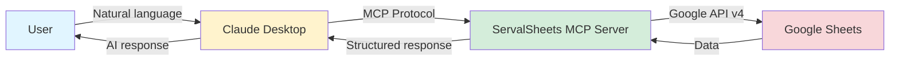
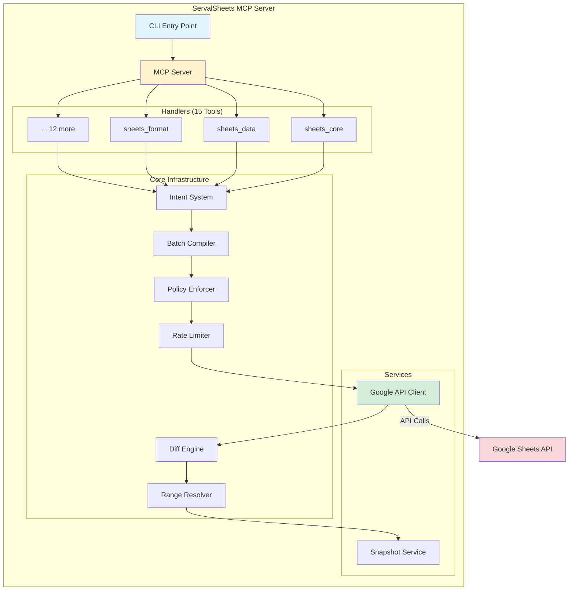

# ServalSheets


Production-grade Google Sheets MCP Server with 22 tools, 315 actions, safety rails, and enterprise features.

[](https://modelcontextprotocol.io)
[](https://www.npmjs.com/package/servalsheets)
[](https://opensource.org/licenses/MIT)
[](https://github.com/khill1269/servalsheets)
[](https://github.com/khill1269/servalsheets)

<p align="center">
  
</p>

## What's New in v1.7.0 (2026-02-17)

🚀 **Modern Formula Intelligence & Marketplace Release**

- ✅ **Named Functions**: LAMBDA-based custom functions via `sheets_advanced` (+5 actions)
- ✅ **Spill Range Detection**: Find dynamic array formulas via `sheets_data.detect_spill_ranges`
- ✅ **Formula Presets**: XLOOKUP, XMATCH, FILTER, BYROW/BYCOL via `sheets_analyze.generate_formula`
- ✅ **Marketplace Ready**: `privacy_policies` array in server.json (MCP registry v0.3+)
- ✅ **Knowledge Base**: Modern arrays & spill range patterns (`src/knowledge/formulas/modern-arrays.md`)

See [CHANGELOG.md](./CHANGELOG.md) for complete details.

---

## Quick Start

```bash
# Install globally
npm install -g servalsheets

# Or run directly with npx
npx servalsheets

# Claude Desktop config (~/.claude/claude_desktop_config.json)
{
  "mcpServers": {
    "servalsheets": {
      "command": "npx",
      "args": ["-y", "servalsheets"]
    }
  }
}
```

On first run, ServalSheets will guide you through Google OAuth authentication.

---

### Previous Releases

<details>
<summary>v1.6.0 - Enterprise Deployment & Infrastructure (2026-01-26)</summary>

- Helm Charts, Terraform Modules (AWS/GCP), Health Monitoring
- W3C Trace Context, Schema Caching, Webhook Support
- Per-User Rate Limiting, VitePress Docs (115+ pages)

</details>

<details>
<summary>v1.6.0 - Zod v4 & Performance (2026-01-10)</summary>

- Upgraded Zod 3.25 → 4.3.5 with native JSON Schema
- 14x faster string parsing, 7x faster arrays
- 57% smaller bundle size

</details>

<details>
<summary>v1.6.0 - MCP Protocol Native (2026-01-06)</summary>

- MCP Logging, Tasks, Elicitation, Sampling support
- 6 URI resource templates, Full AbortController cancellation

</details>

<details>
<summary>v1.6.0 - Advanced Analytics (2026-01-05)</summary>

- Pattern Detection, Column Analysis
- AI-Powered formula generation & chart recommendations

</details>

## Features

### Core Capabilities

- **22 Tools, 315 Actions**: Comprehensive Google Sheets API v4 coverage
- **MCP 2025-11-25 Compliant**: Full protocol compliance with structured outputs
- **Multiple Transports**: STDIO, SSE, and Streamable HTTP
- **Safety Rails**: Dry-run, effect scope limits, expected state validation, user confirmations
- **OAuth 2.1 Support**: For Claude Connectors Directory integration

### MCP Protocol Support

Full compliance with Model Context Protocol 2025-11-25:

- ✅ **JSON-RPC 2.0**: Full compliance via @modelcontextprotocol/sdk v1.26.0
- ✅ **Tools**: 22 tools with 315 actions using discriminated unions
- ✅ **Resources**: 6 URI templates + 7 knowledge resources
  - `sheets:///{spreadsheetId}` - Spreadsheet metadata
  - `sheets:///{spreadsheetId}/{range}` - Range values
  - `sheets:///{spreadsheetId}/charts` - Chart specifications
  - `sheets:///{spreadsheetId}/charts/{chartId}` - Individual chart details
  - `sheets:///{spreadsheetId}/pivots` - Pivot table configurations
  - `sheets:///{spreadsheetId}/quality` - Data quality analysis
  - Knowledge resources for formulas, colors, formats
- ✅ **Prompts**: 6 guided workflows for common operations
- ✅ **Completions**: Argument autocompletion for prompts/resources
- ✅ **Tasks**: Background execution with full cancellation support (SEP-1686)
- ✅ **Elicitation**: Plan confirmation via sheets_confirm (SEP-1036)
- ✅ **Sampling**: AI-powered analysis via sheets_analyze (SEP-1577)
- ✅ **Logging**: Dynamic log level control via logging/setLevel handler

#### Transport Support

- ✅ **STDIO** - For Claude Desktop and local CLI usage
- ✅ **HTTP/SSE** - For web clients and remote access
- ✅ **OAuth 2.1** - Authentication for hosted deployments

### Advanced Analytics 🔬

- **Pattern Detection**: Trend analysis, correlations, anomalies, seasonality
- **Column Profiling**: Data type detection, distributions, quality metrics
- **Statistical Analysis**: Comprehensive data quality and structure insights

### AI-Powered Features 🤖

- **Template Suggestions**: AI generates contextual spreadsheet templates
- **Formula Generation**: Natural language → Google Sheets formulas
- **Chart Recommendations**: AI suggests optimal visualizations for your data
- **Requires**: Client with MCP sampling capability (SEP-1577)

### Performance & Optimization ⚡

- **Request Deduplication**: Prevents duplicate API calls, reduces quota usage
- **Tiered Diff Engine**: Automatic tier selection (METADATA/SAMPLE/FULL)
- **Rate Limiting**: Built-in token bucket with dynamic throttling on 429 errors
- **Payload Monitoring**: Automatic size tracking with 2MB warnings, 10MB hard limits
- **Batch Efficiency**: Real-time optimization analysis and suggestions
- **HTTP Compression**: gzip middleware for bandwidth reduction

### Developer Experience 🛠️

- **Semantic Range Resolution**: Query by header name, named ranges, or A1 notation
- **Intent-Based Architecture**: Single BatchCompiler for all mutations
- **User Confirmations**: Elicitation dialogs for destructive operations (SEP-1036)

### API Documentation 📚

- **OpenAPI 3.1 Specification**: Auto-generated from Zod schemas
- **Interactive Swagger UI**: Test endpoints at `/api-docs` when HTTP server is running
- **Multiple Formats**: JSON and YAML exports for SDK generation
- **22 Tools Documented**: Complete API reference with request/response schemas
- **Authentication Schemes**: Bearer token and OAuth 2.0 documented

**Access Documentation:**

```bash
npm run start:http        # Start HTTP server
open http://localhost:3000/api-docs  # View Swagger UI
```

See [OpenAPI Documentation Guide](docs/guides/OPENAPI_DOCUMENTATION.md) for details.

## Quick Start

### Installation

```bash
npm install servalsheets
```

### Using with Claude Desktop (STDIO)

Add to `~/Library/Application Support/Claude/claude_desktop_config.json`:

```json
{
  "mcpServers": {
    "servalsheets": {
      "command": "npx",
      "args": ["servalsheets"],
      "env": {
        "GOOGLE_APPLICATION_CREDENTIALS": "/path/to/service-account.json"
      }
    }
  }
}
```

### Using as Remote Server (HTTP/SSE)

```bash
# Start HTTP server
npm run start:http

# Or with environment variables
PORT=3000 GOOGLE_CLIENT_ID=xxx GOOGLE_CLIENT_SECRET=xxx npm run start:http
```

### OAuth Scope Modes

ServalSheets uses deployment-aware OAuth scopes to balance functionality and Google verification speed:

| Mode               | Actions Available | Use Case                | Google Verification Time |
| ------------------ | ----------------- | ----------------------- | ------------------------ |
| **full** (default) | 298/298           | Self-hosted, enterprise | 4-6 weeks                |
| **standard**       | 260/298           | SaaS, marketplace apps  | 3-5 days                 |
| **minimal**        | ~180/298          | Basic operations only   | 3-5 days                 |
| **readonly**       | ~120/298          | Analysis/reporting only | 3-5 days                 |

**Self-Hosted (Default)**

All features work out of the box with full scopes:

```bash
npm run auth
npm run start:http
```

**SaaS/Marketplace Deployment**

For faster Google verification (3-5 days instead of 4-6 weeks):

```bash
export DEPLOYMENT_MODE=saas
npm run auth
npm run start:http
```

**Disabled features in standard mode:**

- Sharing/collaboration (sheets_collaborate)
- BigQuery integration (sheets_bigquery)
- Apps Script automation (sheets_appsscript)
- Webhook notifications (sheets_webhook)

**Enable all features:** Set `OAUTH_SCOPE_MODE=full` (accepts longer verification time)

**Environment Variables:**

- `DEPLOYMENT_MODE`: `self-hosted` (default, full scopes) or `saas` (standard scopes)
- `OAUTH_SCOPE_MODE`: Explicit override - `full`, `standard`, `minimal`, `readonly`

## Documentation

ServalSheets has comprehensive documentation organized by use case:

### 🚀 Getting Started

- **[docs/guides/FIRST_TIME_USER.md](./docs/guides/FIRST_TIME_USER.md)** - First-time user walkthrough (start here!)
- **[docs/guides/CLAUDE_DESKTOP_SETUP.md](./docs/guides/CLAUDE_DESKTOP_SETUP.md)** - Claude Desktop setup
- **[docs/guides/INSTALLATION_GUIDE.md](./docs/guides/INSTALLATION_GUIDE.md)** - Installation instructions
- **[docs/guides/QUICKSTART_CREDENTIALS.md](./docs/guides/QUICKSTART_CREDENTIALS.md)** - Quick credentials setup

### 📖 User Guides

- **[docs/guides/USAGE_GUIDE.md](./docs/guides/USAGE_GUIDE.md)** - Complete usage guide
- **[docs/guides/PROMPTS_GUIDE.md](./docs/guides/PROMPTS_GUIDE.md)** - Effective AI prompts
- **[docs/guides/OAUTH_USER_SETUP.md](./docs/guides/OAUTH_USER_SETUP.md)** - OAuth authentication
- **[docs/guides/TROUBLESHOOTING.md](./docs/guides/TROUBLESHOOTING.md)** - Common issues
- **[docs/guides/SKILL.md](./docs/guides/SKILL.md)** - Claude skill integration

### 🏭 Production & Operations

- **[docs/guides/DEPLOYMENT.md](./docs/guides/DEPLOYMENT.md)** - Production deployment
- **[docs/guides/MONITORING.md](./docs/guides/MONITORING.md)** - Monitoring & observability
- **[docs/guides/PERFORMANCE.md](./docs/guides/PERFORMANCE.md)** - Performance optimization
- **[SECURITY.md](./SECURITY.md)** - Security policy

### 📚 Complete Documentation Index

- **[docs/README.md](./docs/README.md)** - Full documentation index with all guides, development docs, and release notes

### 🔐 Production

- **[SECURITY.md](./SECURITY.md)** - Security best practices
- **[docs/guides/PERFORMANCE.md](./docs/guides/PERFORMANCE.md)** - Performance tuning
- **[docs/guides/MONITORING.md](./docs/guides/MONITORING.md)** - Observability setup
- **[docs/guides/DEPLOYMENT.md](./docs/guides/DEPLOYMENT.md)** - Deployment examples
- **[docs/guides/TROUBLESHOOTING.md](./docs/guides/TROUBLESHOOTING.md)** - Common issues

**Need help?** Start with [docs/guides/USAGE_GUIDE.md](./docs/guides/USAGE_GUIDE.md) for a complete walkthrough.

## Contributing

We welcome contributions! ServalSheets follows strict quality standards to maintain production-grade reliability.

### Quick Links

- **[Developer Workflow Guide](./docs/development/DEVELOPER_WORKFLOW.md)** - Step-by-step guide for contributors
- **[Claude Code Rules](./docs/development/CLAUDE_CODE_RULES.md)** - Required rules for all contributions

### Quick Start for Contributors

```bash
# 1. Clone and install
git clone https://github.com/khill1269/servalsheets.git
cd servalsheets
npm install

# 2. Create feature branch
git checkout -b fix/your-bug-name

# 3. Make changes (≤3 src/ files recommended)
# Edit src/handlers/values.ts

# 4. Verify (must pass before PR)
npm run verify

# 5. Commit and push
git commit -m "fix(values): handle empty arrays gracefully"
git push origin fix/your-bug-name
```

### Core Principles

All contributions must follow these [Claude Code Rules](./docs/development/CLAUDE_CODE_RULES.md):

1. **Verify Before Claiming** - Provide file paths + line ranges for all claims
2. **Trace Execution Paths** - Document the full call stack
3. **No "Fixes" Without Proof** - Write failing test first, then fix
4. **Minimal Change Policy** - ≤3 files in `src/` per commit
5. **No Silent Fallbacks** - Log errors, never return `{}` silently

### Verification Commands

```bash
npm run verify              # Full verification pipeline
npm run check:drift         # Metadata synchronization
npm run check:placeholders  # No TODO/FIXME in src/
npm run check:silent-fallbacks  # No silent {} returns
npm run check:debug-prints  # No console.log in src/
npm test                    # Run 1761 tests
```

### Before Creating a PR

- [ ] All tests pass (`npm test`)
- [ ] Verification passes (`npm run verify`)
- [ ] ≤3 `src/` files modified (or documented exception)
- [ ] Evidence provided in commit message
- [ ] Follows [Claude Code Rules](./docs/development/CLAUDE_CODE_RULES.md)

See the [Developer Workflow Guide](./docs/development/DEVELOPER_WORKFLOW.md) for detailed instructions.

## Tools Reference

### Tool Summary (22 tools, 315 actions)

| Tool                  | Actions | Description                                                       |
| --------------------- | ------- | ----------------------------------------------------------------- |
| `sheets_auth`         | 4       | Authentication & OAuth                                            |
| `sheets_core`         | 19      | Spreadsheet and sheet metadata/management                         |
| `sheets_data`         | 19      | Read/write values, notes, hyperlinks, clipboard                   |
| `sheets_format`       | 23      | Cell formatting, conditional formats, data validation, sparklines |
| `sheets_dimensions`   | 28      | Rows/columns, filters, sorts, groups, freezes, views, slicers     |
| `sheets_visualize`    | 18      | Charts and pivot tables                                           |
| `sheets_collaborate`  | 35      | Sharing, comments, versions/snapshots                             |
| `sheets_advanced`     | 31      | Named ranges, protected ranges, metadata, banding, tables, chips  |
| `sheets_transaction`  | 6       | Transaction management                                            |
| `sheets_quality`      | 4       | Validation, conflicts, impact analysis                            |
| `sheets_history`      | 7       | Undo/redo, history, revert                                        |
| `sheets_confirm`      | 5       | Elicitation confirmations & wizards                               |
| `sheets_analyze`      | 16      | AI-assisted analysis & recommendations                            |
| `sheets_fix`          | 1       | Automated fixes from analysis                                     |
| `sheets_composite`    | 11      | High-level bulk operations                                        |
| `sheets_session`      | 26      | Session context and references                                    |
| `sheets_appsscript`   | 18      | Apps Script automation                                            |
| `sheets_bigquery`     | 17      | BigQuery Connected Sheets                                         |
| `sheets_templates`    | 8       | Enterprise templates                                              |
| `sheets_webhook`      | 7       | Webhook registration & delivery                                   |
| `sheets_dependencies` | 7       | Formula dependency analysis                                       |

## Examples

### Example 1: Read and Analyze Data

```javascript
// Read sales data
const result = await sheets_data({
  action: 'read',
  spreadsheetId: '1BxiMVs0XRA5nFMdKvBdBZjgmUUqptlbs74OgvE2upms',
  range: { a1: 'Sales!A1:D100' },
  valueRenderOption: 'FORMATTED_VALUE',
});

// Analyze data quality
const analysis = await sheets_analyze({
  action: 'analyze_quality',
  spreadsheetId: '1BxiMVs0XRA5nFMdKvBdBZjgmUUqptlbs74OgvE2upms',
  range: { a1: 'Sales!A1:D100' },
});
// Returns: { completeness: 0.95, duplicates: 3, outliers: [...] }
```

### Example 2: Safe Bulk Update with Dry Run

```javascript
// Preview changes first (dry run)
const preview = await sheets_data({
  action: 'write',
  spreadsheetId: '1BxiMVs0XRA5nFMdKvBdBZjgmUUqptlbs74OgvE2upms',
  range: { a1: 'Data!A2:C100' },
  values: newData,
  safety: {
    dryRun: true,
    effectScope: { maxCellsAffected: 500 },
  },
});
// Returns: { dryRun: true, cellsAffected: 297 }

// Execute if safe
if (preview.data.cellsAffected < 500) {
  const result = await sheets_data({
    action: 'write',
    spreadsheetId: '1BxiMVs0XRA5nFMdKvBdBZjgmUUqptlbs74OgvE2upms',
    range: { a1: 'Data!A2:C100' },
    values: newData,
    safety: {
      expectedState: { rowCount: 100 },
      autoSnapshot: true,
    },
  });
}
```

### Example 3: Semantic Range Queries

```javascript
// Query by column header instead of A1 notation
const revenue = await sheets_data({
  action: 'read',
  spreadsheetId: '1BxiMVs0XRA5nFMdKvBdBZjgmUUqptlbs74OgvE2upms',
  range: {
    semantic: {
      sheet: 'Q4 Sales',
      column: 'Total Revenue', // Matches header in row 1
      includeHeader: false,
    },
  },
});

// Returns cell values
// {
//   success: true,
//   action: 'read',
//   values: [[5000], [7500], [3200], ...]
// }
```

### Example 4: Create Charts

```javascript
// Create a bar chart from data
const chart = await sheets_visualize({
  action: 'create',
  spreadsheetId: '1BxiMVs0XRA5nFMdKvBdBZjgmUUqptlbs74OgvE2upms',
  sheetId: 0,
  chartType: 'BAR',
  title: 'Monthly Sales',
  data: { sourceRange: { a1: 'Sales!A1:B12' } },
  position: {
    anchorCell: 'Sheet1!F1',
    width: 600,
    height: 400,
  },
});
```

### Example 5: Conditional Formatting

```javascript
// Add conditional formatting rule
const rule = await sheets_format({
  action: 'add_conditional_format',
  spreadsheetId: '1BxiMVs0XRA5nFMdKvBdBZjgmUUqptlbs74OgvE2upms',
  sheetId: 0,
  range: { a1: 'Data!B2:B100' },
  rule: {
    type: 'NUMBER_GREATER',
    values: [{ userEnteredValue: '1000' }],
  },
  format: {
    backgroundColor: { red: 0.7, green: 1, blue: 0.7 }, // Light green
  },
});
```

## Marketplace Examples

Complete, copy-pasteable prompts for Claude Desktop or any MCP client.

### Example 1: Sales Dashboard with XLOOKUP Formulas

> "Create a sales dashboard in spreadsheet 1BxiMVs0... with XLOOKUP formulas that look up product names from a Products sheet and return their category and price."

```json
// Step 1: Generate the XLOOKUP formula
{ "action": "generate_formula", "spreadsheetId": "1BxiMVs0...", "formulaType": "xlookup",
  "description": "Look up product name in Products!A:A and return the category from Products!C:C",
  "targetCell": "D2" }

// Step 2: Write the formula to the dashboard
{ "action": "write", "spreadsheetId": "1BxiMVs0...", "range": "Dashboard!D2",
  "values": [["=XLOOKUP(A2,Products!A:A,Products!C:C,\"Unknown\")"]] }

// Step 3: Format the dashboard
{ "action": "batch_format", "spreadsheetId": "1BxiMVs0...",
  "operations": [{ "range": "Dashboard!A1:E1", "preset": "header_row" }] }
```

---

### Example 2: Quarterly Data Analysis with Charts

> "Analyze my Q4 revenue data in sheet 'Q4 Data' and create a column chart comparing monthly revenue."

```json
// Step 1: Scout the spreadsheet structure
{ "action": "scout", "spreadsheetId": "1BxiMVs0..." }

// Step 2: Comprehensive analysis
{ "action": "comprehensive", "spreadsheetId": "1BxiMVs0...", "range": "'Q4 Data'!A1:D100" }

// Step 3: Create the chart
{ "action": "suggest_chart", "spreadsheetId": "1BxiMVs0...", "range": "'Q4 Data'!A1:D13" }
```

---

### Example 3: Import CSV, Deduplicate, and Format as Table

> "Import this CSV of customer data, remove duplicates on the email column, and format it as a styled table."

```json
// Step 1: Import the CSV
{ "action": "import_csv", "spreadsheetId": "1BxiMVs0...", "sheetName": "Customers",
  "csvData": "Name,Email,Revenue\nAlice,alice@co.com,5000\n..." }

// Step 2: Deduplicate on Email column
{ "action": "deduplicate", "spreadsheetId": "1BxiMVs0...", "range": "Customers!A1:C100",
  "keyColumns": ["Email"], "keep": "first" }

// Step 3: Create a table
{ "action": "create_table", "spreadsheetId": "1BxiMVs0...", "range": "Customers!A1:C50",
  "tableName": "CustomerTable", "hasHeaders": true }
```

---

### Example 4: Automated Sharing and Version Snapshots

> "Share my budget spreadsheet with the finance team, create a version snapshot before making changes, and track the edit."

```json
// Step 1: Create a version snapshot before editing
{ "action": "version_create_snapshot", "spreadsheetId": "1BxiMVs0...",
  "name": "Pre-Q4-Budget-Edit", "description": "Snapshot before Q4 budget update" }

// Step 2: Share with the team
{ "action": "share_add", "spreadsheetId": "1BxiMVs0...",
  "emailAddress": "finance-team@company.com", "role": "writer",
  "sendNotification": true, "emailMessage": "Q4 budget ready for review" }

// Step 3: Make changes, then create another snapshot
{ "action": "version_create_snapshot", "spreadsheetId": "1BxiMVs0...",
  "name": "Post-Q4-Budget-Edit" }
```

---

### Example 5: Build a Named Function Library for Reuse

> "Create reusable named functions for profit margin and CAGR calculations, then apply them to my financial model."

```json
// Step 1: Create a profit margin named function
{ "action": "create_named_function", "spreadsheetId": "1BxiMVs0...",
  "functionName": "PROFIT_MARGIN",
  "functionBody": "LAMBDA(revenue, cost, (revenue-cost)/revenue)",
  "description": "Calculate profit margin as a decimal",
  "parameterDefinitions": [
    { "name": "revenue", "description": "Total revenue" },
    { "name": "cost", "description": "Total cost" }
  ] }

// Step 2: Create a CAGR function
{ "action": "create_named_function", "spreadsheetId": "1BxiMVs0...",
  "functionName": "CAGR",
  "functionBody": "LAMBDA(start_val, end_val, periods, (end_val/start_val)^(1/periods)-1)",
  "description": "Compound Annual Growth Rate" }

// Step 3: Use in your sheet
{ "action": "write", "spreadsheetId": "1BxiMVs0...", "range": "Model!D2",
  "values": [["=PROFIT_MARGIN(B2,C2)"]] }
```

---

## Safety Rails

### Dry Run Mode

Preview changes without executing:

```javascript
{
  safety: {
    dryRun: true;
  }
}
```

### Effect Scope Limits

Prevent accidental large-scale changes:

```javascript
{
  safety: {
    effectScope: {
      maxCellsAffected: 5000,
      requireExplicitRange: true
    }
  }
}
```

### Expected State (Optimistic Locking)

Ensure data hasn't changed since last read:

```javascript
{
  safety: {
    expectedState: {
      rowCount: 100,
      sheetTitle: 'Sales Data',
      checksum: 'abc123'
    }
  }
}
```

### Auto-Snapshot

Create backup before destructive operations:

```javascript
{
  safety: {
    autoSnapshot: true;
  }
}
```

## Range Input Formats

ServalSheets accepts multiple range formats:

```javascript
// A1 notation
{ a1: "Sheet1!A1:C10" }

// Named range
{ namedRange: "SalesData" }

// Grid coordinates (0-based, end exclusive)
{ grid: { sheetId: 0, startRowIndex: 0, endRowIndex: 10, startColumnIndex: 0, endColumnIndex: 3 } }

// Semantic (header-based)
{ semantic: { sheet: "Sales", column: "Revenue", includeHeader: false } }
```

## Error Codes

| Code                    | Description             | Retryable |
| ----------------------- | ----------------------- | --------- |
| `PARSE_ERROR`           | Invalid JSON            | No        |
| `INVALID_PARAMS`        | Invalid parameters      | No        |
| `SHEET_NOT_FOUND`       | Sheet doesn't exist     | No        |
| `RANGE_NOT_FOUND`       | Range not found         | No        |
| `PERMISSION_DENIED`     | No access               | No        |
| `QUOTA_EXCEEDED`        | API quota exceeded      | Yes       |
| `RATE_LIMITED`          | Too many requests       | Yes       |
| `PRECONDITION_FAILED`   | Expected state mismatch | No        |
| `EFFECT_SCOPE_EXCEEDED` | Operation too large     | No        |
| `AMBIGUOUS_RANGE`       | Multiple header matches | No        |

## Authentication

### Service Account (Recommended for automation)

```bash
export GOOGLE_APPLICATION_CREDENTIALS=/path/to/service-account.json
npx servalsheets
```

### OAuth2 Access Token

```bash
export GOOGLE_ACCESS_TOKEN=ya29.xxx
npx servalsheets
```

### OAuth2 Client Credentials

```bash
export GOOGLE_CLIENT_ID=xxx
export GOOGLE_CLIENT_SECRET=xxx
npx servalsheets
```

### Encrypted Token Store (Optional)

Persist OAuth tokens across restarts using an encrypted file store.

```bash
export GOOGLE_TOKEN_STORE_PATH=~/.config/servalsheets/tokens.enc
export ENCRYPTION_KEY=<64-char-hex-key>
npx servalsheets
```

The key must be a 64-character hex string (32 bytes). Example:

```bash
openssl rand -hex 32
```

## Configuration

ServalSheets supports extensive configuration via environment variables for production deployments.

### Required for Production (HTTP/Remote Server)

When running ServalSheets as an HTTP or remote server with OAuth support, these environment variables are **required** in production mode:

```bash
# Required Production Secrets (generate with: openssl rand -hex 32)
export JWT_SECRET=<64-char-hex-string>
export STATE_SECRET=<64-char-hex-string>
export OAUTH_CLIENT_SECRET=<64-char-hex-string>

# OAuth Security (comma-separated list of allowed callback URIs)
export ALLOWED_REDIRECT_URIS=https://your-app.com/callback,https://another-app.com/callback

# Environment mode
export NODE_ENV=production
```

**Security Notes**:

- Each secret should be a unique 64-character hex string
- Never commit secrets to version control
- Rotate secrets every 90 days
- Use a secrets manager in production (AWS Secrets Manager, Vault, etc.)

See [SECURITY.md](./SECURITY.md) for detailed security best practices.

### Optional: Redis for Session Storage

For production deployments with multiple instances or high availability requirements:

```bash
# Install Redis dependency
npm install redis

# Configure Redis URL
export REDIS_URL=redis://localhost:6379

# Optional: Maximum sessions per user (default: 5)
export MAX_SESSIONS_PER_USER=5

# Optional: Streamable HTTP event store (resumability)
export STREAMABLE_HTTP_EVENT_TTL_MS=300000
export STREAMABLE_HTTP_EVENT_MAX_EVENTS=5000
```

Redis provides:

- Shared session storage across multiple server instances
- Persistent sessions across server restarts
- Streamable HTTP resumability across instances
- Better performance at scale

### Rate Limiting

Control API quota usage with token bucket rate limiting:

```bash
# Configure rate limits (default: 300 reads/min, 60 writes/min)
export RATE_LIMIT_READS_PER_MINUTE=300
export RATE_LIMIT_WRITES_PER_MINUTE=60
```

**Google Sheets API Quotas by Workspace Edition**:

| Workspace Edition     | Read Quota | Write Quota | Configuration                                                       |
| --------------------- | ---------- | ----------- | ------------------------------------------------------------------- |
| **Free/Personal**     | 300/min    | 60/min      | (default values)                                                    |
| **Business Standard** | 600/min    | 120/min     | `RATE_LIMIT_READS_PER_MINUTE=600 RATE_LIMIT_WRITES_PER_MINUTE=120`  |
| **Business Plus**     | 900/min    | 180/min     | `RATE_LIMIT_READS_PER_MINUTE=900 RATE_LIMIT_WRITES_PER_MINUTE=180`  |
| **Enterprise**        | 1200/min   | 240/min     | `RATE_LIMIT_READS_PER_MINUTE=1200 RATE_LIMIT_WRITES_PER_MINUTE=240` |

**Note**: Actual quotas depend on your Google Cloud project configuration. Check your [Google Cloud Console](https://console.cloud.google.com/apis/api/sheets.googleapis.com/quotas) for exact limits.

**Dynamic Throttling**: When a 429 (rate limit) error is detected, the rate limiter automatically reduces rates by 50% for 60 seconds, then restores normal limits.

Adjust these based on your Google Cloud project quotas. See `PERFORMANCE.md` for tuning strategies.

### Caching

Configure cache TTLs and sizes:

```bash
# Enable/disable caching (default: enabled)
export CACHE_ENABLED=true

# Cache configuration
export CACHE_MAX_SIZE_MB=100
export CACHE_TTL_MS=300000  # 5 minutes
```

Caching reduces API calls by 100x for repeated reads. Increase TTLs for read-heavy workloads.

### Observability

Configure tracing and monitoring:

```bash
# Enable OpenTelemetry tracing
export OTEL_ENABLED=true
export OTEL_LOG_SPANS=true  # Log spans to console

# Request deduplication
export DEDUPLICATION_ENABLED=true
export DEDUP_WINDOW_MS=5000  # 5 seconds
```

**Automatic Monitoring**:

- **Payload sizes**: All Google API requests/responses tracked
- **Batch efficiency**: Intents per spreadsheet ratio analyzed
- **Rate limiting**: Dynamic throttling on 429 errors
- **HTTP compression**: Response sizes reduced by 60-80%

Statistics available via lifecycle methods:

- `getCacheStats()` - Cache hit rates, sizes
- `getDeduplicationStats()` - Deduplication rates
- `getBatchEfficiencyStats()` - Batch optimization metrics
- `getTracingStats()` - OpenTelemetry span counts

### Effect Scope Limits

Prevent accidental large-scale operations:

Resource limits are currently configured with hard-coded defaults:

- Maximum cells per operation: 10,000
- Maximum sheets per operation: 10

_(Note: Environment variable configuration coming in future release)_

These limits act as safety rails. Operations exceeding limits will fail with `EFFECT_SCOPE_EXCEEDED` error.

### Logging

Configure structured logging:

```bash
# Log level: debug, info, warn, error (default: info)
export LOG_LEVEL=info

# Log format: json, text (default: json for production)
export LOG_FORMAT=json

# Log file path (optional, defaults to stdout)
export LOG_FILE=/var/log/servalsheets/app.log
```

JSON format is recommended for production (machine-parseable). See `MONITORING.md` for log aggregation.

### Timeouts

Configure API and request timeouts:

```bash
# Google API timeout (default: 30s)
export GOOGLE_API_TIMEOUT_MS=30000

# Request timeout (default: 120s)
export REQUEST_TIMEOUT_MS=120000
```

### HTTP/2 and Connection Pool

Configure HTTP/2 and connection pooling for optimal performance:

```bash
# Enable/disable HTTP/2 (default: true)
export GOOGLE_API_HTTP2_ENABLED=true

# Maximum concurrent connections (default: 50)
export GOOGLE_API_MAX_SOCKETS=50

# Keep-alive timeout in milliseconds (default: 30000)
export GOOGLE_API_KEEPALIVE_TIMEOUT=30000

# Enable connection pool monitoring (default: false)
export ENABLE_HTTP2_POOL_MONITORING=true

# Monitoring interval in milliseconds (default: 300000 = 5 minutes)
export HTTP2_POOL_MONITOR_INTERVAL_MS=300000
```

**Benefits of HTTP/2:**

- 5-15% latency reduction for API calls
- Connection multiplexing (multiple requests per connection)
- Header compression reduces overhead

**Connection Pool Monitoring:**
When enabled, logs connection pool statistics at regular intervals:

- Active sockets (in-use connections)
- Free sockets (available in pool)
- Pending requests (waiting for connection)
- Pool utilization percentage
- Automatic warnings at 80% and 100% utilization

Recommended for production to detect connection pool exhaustion before it impacts performance.

### Metrics Server

Expose performance metrics via HTTP endpoint for monitoring:

```bash
# Enable metrics server (default: false)
export ENABLE_METRICS_SERVER=true

# Metrics server port (default: 9090)
export METRICS_PORT=9090

# Metrics server host (default: 127.0.0.1)
export METRICS_HOST=127.0.0.1
```

**Available endpoints:**

| Endpoint        | Format              | Description                        |
| --------------- | ------------------- | ---------------------------------- |
| `/metrics`      | Prometheus text     | Recommended for Prometheus/Grafana |
| `/metrics.json` | JSON                | Programmatic access                |
| `/metrics.txt`  | Human-readable text | Quick inspection                   |
| `/health`       | JSON                | Health check endpoint              |

**Metrics exposed:**

- **Cache metrics**: Hit rate, hits/misses, evictions, size by cache type
- **Batching metrics**: Current window size, total batches, average batch size, deduplication count
- **API metrics**: Total calls by method, errors by code, success/error rates

**Example Prometheus configuration:**

```yaml
scrape_configs:
  - job_name: 'servalsheets'
    static_configs:
      - targets: ['localhost:9090']
    scrape_interval: 15s
```

**Access metrics:**

```bash
# Prometheus format
curl http://localhost:9090/metrics

# JSON format
curl http://localhost:9090/metrics.json

# Human-readable
curl http://localhost:9090/metrics.txt
```

### Memory Leak Detection

Monitor Node.js heap usage to detect memory leaks before they cause crashes:

```bash
# Enable heap monitoring (default: false)
export ENABLE_HEAP_MONITORING=true

# Monitoring interval in milliseconds (default: 1800000 = 30 minutes)
export HEAP_MONITOR_INTERVAL_MS=1800000

# Warning threshold (0-1, default: 0.7 = 70%)
export HEAP_WARNING_THRESHOLD=0.7

# Critical threshold (0-1, default: 0.85 = 85%)
export HEAP_CRITICAL_THRESHOLD=0.85

# Enable heap snapshots at critical threshold (default: false)
export ENABLE_HEAP_SNAPSHOTS=true

# Heap snapshot directory (default: ./heap-snapshots)
export HEAP_SNAPSHOT_PATH=./heap-snapshots
```

**Alerting thresholds:**

- **Warning (70%):** Logs elevated heap usage, monitor for sustained growth
- **Critical (85%):** Logs error with recommendation, optionally captures heap snapshot
- **Automatic throttling:** Alerts limited to once every 5-15 minutes to prevent spam

**Heap snapshots:**
When enabled, heap snapshots are captured at critical threshold for post-mortem analysis:

- **Chrome DevTools:** Open snapshot in Memory Profiler
- **clinic.js:** `npm install -g clinic` then `clinic heapprofiler`

**Recommendations by utilization:**

- **95%+:** Immediate restart required to prevent OOM crash
- **85-95%:** Schedule restart, investigate with heap snapshots
- **70-85%:** Monitor trends, review cache policies and connection pools
- **<70%:** Normal operation

### Example: Production Configuration

Complete production setup for Claude Desktop:

```json
{
  "mcpServers": {
    "servalsheets": {
      "command": "npx",
      "args": ["servalsheets"],
      "env": {
        "NODE_ENV": "production",
        "LOG_LEVEL": "info",
        "LOG_FORMAT": "json",

        "GOOGLE_APPLICATION_CREDENTIALS": "/path/to/service-account.json",
        "GOOGLE_TOKEN_STORE_PATH": "/path/to/tokens.enc",
        "ENCRYPTION_KEY": "<64-char-hex-key>"
      }
    }
  }
}
```

For detailed configuration guides, see:

- **Security**: `SECURITY.md` - Authentication, encryption, secrets management
- **Performance**: `PERFORMANCE.md` - Rate limiting strategies, diff tiers, batching
- **Monitoring**: `MONITORING.md` - Logging, metrics, alerting, health checks
- **Deployment**: `DEPLOYMENT.md` - Docker, Kubernetes, systemd, cloud platforms
- **Troubleshooting**: `TROUBLESHOOTING.md` - Common issues and solutions

## Development

```bash
# Clone repository
git clone https://github.com/khill1269/servalsheets.git
cd servalsheets

# Install dependencies
npm install

# Build
npm run build

# Type check (strict mode)
npm run typecheck

# Run tests (1761 tests)
npm test

# Run in development mode
npm run dev

# Start HTTP server
npm run start:http

# Start remote server with OAuth
npm run start:remote
```

## Architecture

```
src/
├── schemas/           # Zod schemas for all 22 tools
├── core/              # Core infrastructure
│   ├── intent.ts          # Intent types and mappings
│   ├── batch-compiler.ts  # Compiles intents to API requests
│   ├── rate-limiter.ts    # Token bucket rate limiting
│   ├── diff-engine.ts     # Tiered diff generation
│   ├── policy-enforcer.ts # Safety policy validation
│   └── range-resolver.ts  # Semantic range resolution
├── services/          # External service integrations
│   ├── google-api.ts      # Google API client
│   └── snapshot.ts        # Backup/restore service
├── handlers/          # Tool handlers
├── server.ts          # MCP server (STDIO)
├── http-server.ts     # HTTP/SSE transport
├── oauth-provider.ts  # OAuth 2.1 for Claude Connectors
├── cli.ts             # CLI entry point
└── index.ts           # Main exports
```

### Data Flow



### Component Architecture



## Protocol Compliance

- **MCP Protocol**: 2025-11-25 (discriminated unions, progress notifications)
- **Google Sheets API**: v4 (full coverage)
- **OAuth**: 2.1 with PKCE support
- **Transports**: STDIO, SSE, Streamable HTTP
- **TypeScript**: Strict mode enabled, 0 errors
- **SDK Version**: @modelcontextprotocol/sdk@1.26.0
- **Test Coverage**: 1761 tests passing across 78 suites

## Quality Metrics

- ✅ **Type Safety**: Full TypeScript strict mode compliance
- ✅ **Test Coverage**: 1761 tests, 100% handler coverage
- ✅ **Protocol Compliance**: MCP 2025-11-25 certified
- ✅ **Production Ready**: Used in Claude Connectors Directory
- ✅ **Error Handling**: Comprehensive error codes with retry hints

## Schema Architecture: Discriminated Unions

ServalSheets uses **Zod discriminated unions** for type-safe action dispatch across 22 tools and 315 actions. This architecture provides:

### Pattern Overview

Each tool defines a discriminated union schema where the `action` field serves as the discriminator:

```typescript
// Example: sheets_auth tool (4 actions)
const SheetsAuthInputSchema = z.object({
  request: z.discriminatedUnion('action', [
    z.object({ action: z.literal('status'), verbosity: VerbositySchema }),
    z.object({ action: z.literal('login'), scopes: ScopesSchema, verbosity: VerbositySchema }),
    z.object({ action: z.literal('callback'), code: z.string(), verbosity: VerbositySchema }),
    z.object({ action: z.literal('logout'), verbosity: VerbositySchema }),
  ]),
});
```

### Benefits

- **Type Safety**: TypeScript compiler ensures all action variants are handled
- **Zero Runtime Overhead**: Discriminated unions compile to efficient JavaScript
- **Exhaustiveness Checking**: Handlers must implement all action types
- **Zod v4 Native JSON Schema**: Direct OpenAPI/MCP schema generation
- **Performance**: 14x faster string parsing, 7x faster arrays (Zod 4.3.5)

### Tool Structure

All 22 tools follow this pattern:

```
Tool: sheets_[category]
├─ Input: Discriminated union of action variants
├─ Output: Success/Error discriminated union
├─ Type Narrowing: Auto-generated type guards per action
└─ Handlers: Single method per action variant
```

**Example Action Variants** (sheets_data):

| Action        | Input Shape                                                   | Output             | Use Case                    |
| ------------- | ------------------------------------------------------------- | ------------------ | --------------------------- |
| `read`        | `{ action: 'read', spreadsheetId, range, valueRenderOption }` | Values array       | Fetch cell data             |
| `write`       | `{ action: 'write', spreadsheetId, range, values, safety }`   | Write summary      | Update cells                |
| `batch_read`  | `{ action: 'batch_read', spreadsheetId, ranges }`             | Multi-range values | Fetch multiple ranges       |
| `batch_write` | `{ action: 'batch_write', spreadsheetId, data }`              | Batch summary      | Multi-range update          |
| `append`      | `{ action: 'append', spreadsheetId, range, values }`          | Append summary     | Add rows                    |
| `clear`       | `{ action: 'clear', spreadsheetId, range }`                   | Clear summary      | Delete values (keep format) |

### Response Format

All tool responses use a **discriminated union by `success` field**:

```typescript
// Success response
{
  success: true,
  action: 'read',
  values: [[...cell values...]],
  _meta: { requestId, duration, cacheHit, ... }
}

// Error response
{
  success: false,
  error: {
    code: 'QUOTA_EXCEEDED',
    message: '...',
    retryable: true,
    retryAfterMs: 60000,
    resolution: '...',
    resolutionSteps: ['...']
  }
}
```

### 22 Tools Overview

| Tool                  | Actions | Pattern                                           | Use Case               |
| --------------------- | ------- | ------------------------------------------------- | ---------------------- |
| `sheets_auth`         | 4       | Status, Login, Callback, Logout                   | OAuth & credentials    |
| `sheets_core`         | 19      | Get, Create, Delete, List, Update                 | Sheet metadata         |
| `sheets_data`         | 19      | Read, Write, Append, Clear, Batch ops             | Cell values & notes    |
| `sheets_format`       | 23      | Colors, Borders, Validation, Conditionals         | Styling & rules        |
| `sheets_dimensions`   | 28      | Insert, Delete, Resize, Filter, Sort, Freeze      | Rows & columns         |
| `sheets_visualize`    | 18      | Create, Update charts, Pivot tables               | Charts & pivots        |
| `sheets_collaborate`  | 35      | Share, Comments, Versions, Snapshots              | Multi-user features    |
| `sheets_advanced`     | 31      | Named ranges, Protected ranges, Metadata, Banding | Advanced features      |
| `sheets_transaction`  | 6       | Begin, Queue, Commit, Rollback                    | Atomic operations      |
| `sheets_quality`      | 4       | Validate, Detect conflicts, Impact analysis       | Data quality           |
| `sheets_history`      | 7       | Undo, Redo, Revert, List history                  | Version control        |
| `sheets_confirm`      | 5       | Request, Wizard, Elicitation                      | User confirmations     |
| `sheets_analyze`      | 16      | Comprehensive, Scout, Planner, Quality analysis   | AI analysis            |
| `sheets_fix`          | 1       | Auto-fix detected issues                          | Automated fixes        |
| `sheets_composite`    | 11      | Import CSV, Deduplicate, Smart append             | Bulk operations        |
| `sheets_session`      | 26      | Set active, Get context, Save checkpoint          | Session context        |
| `sheets_appsscript`   | 18      | Run, Deploy, Get content                          | Apps Script automation |
| `sheets_bigquery`     | 17      | Query, Import, Connect Looker                     | BigQuery integration   |
| `sheets_templates`    | 8       | List, Create, Apply, Import builtin               | Templates              |
| `sheets_webhook`      | 7       | Register, Unregister, List, Test                  | Change notifications   |
| `sheets_dependencies` | 7       | Build, Analyze, Detect cycles, Export             | Formula analysis       |

---

## Error Handling: Recovery Strategies

ServalSheets implements a comprehensive error classification system with recovery strategies for each error type. All errors inherit from `ServalSheetsError` and provide actionable resolution steps.

### Error Classes and Recovery

#### 1. ValidationError (Non-Retryable)

**When**: Invalid input, malformed data, type mismatches

**Recovery Strategy**:

```typescript
// Error details always include field name and expected format
{
  code: 'VALIDATION_ERROR',
  message: 'Invalid spreadsheetId format',
  field: 'spreadsheetId',
  expectedFormat: 'String matching /^[a-zA-Z0-9-_]{44}$/',
  retryable: false,
  resolution: "Fix the value of 'spreadsheetId' and retry the operation.",
  resolutionSteps: [
    "1. Check the value of 'spreadsheetId'",
    "2. Ensure it matches the required format",
    "3. Expected format: String matching /^[a-zA-Z0-9-_]{44}$/"
  ]
}
```

**Action**: Fix input and retry immediately (no backoff needed)

#### 2. AuthenticationError (Retryable)

**When**: Token expired, invalid credentials, auth flow failures

**Recovery Strategy**:

```typescript
// Retryable auth errors include refresh instructions
{
  code: 'TOKEN_EXPIRED',
  message: 'Access token expired',
  retryable: true,
  resolution: 'Re-authenticate and retry the operation.',
  resolutionSteps: [
    '1. Refresh your access token',
    '2. Re-authenticate if refresh fails',
    '3. Retry the operation'
  ]
}
```

**Action**:

1. Attempt token refresh
2. If refresh fails, restart OAuth flow
3. Retry operation with new token
4. Use exponential backoff (1s, 2s, 4s, 8s)

#### 3. QuotaExceededError (Retryable with Smart Backoff)

**When**: API quota exhausted, rate limited (429 errors)

**Recovery Strategy**:

```typescript
{
  code: 'QUOTA_EXCEEDED',
  message: 'Read quota exceeded (300 reads/min)',
  retryable: true,
  retryAfterMs: 60000,           // Wait 60 seconds before retry
  retryStrategy: 'exponential_backoff',
  quotaType: 'read',             // read | write | requests | unknown
  resetTime: '2026-02-05T18:05:00Z',
  resolution: 'Wait 60 seconds, then retry with optimized batch operations',
  resolutionSteps: [
    '1. Wait 60 seconds before retrying (quota resets at 2026-02-05T18:05:00Z)',
    '2. Optimize future requests:',
    '   - Use batch operations: sheets_data action="batch_read" (saves ~80% quota)',
    '   - Use transactions: sheets_transaction (batches 10+ ops into 1 API call)',
    '   - Enable caching for repeated reads',
    '3. Increase quotas in Google Cloud Console'
  ]
}
```

**Action**:

1. Wait `retryAfterMs` (usually 60 seconds)
2. Use batch operations to reduce future quota usage
3. Enable caching (see Performance Tuning section)
4. Implement request deduplication
5. Request higher quotas from Google Cloud Console

**Optimization** (80-90% quota savings):

```typescript
// Before: 3 separate API calls = 3 quota units
await sheets_data({ action: 'read', range: 'A1:A100' });
await sheets_data({ action: 'read', range: 'B1:B100' });
await sheets_data({ action: 'read', range: 'C1:C100' });

// After: 1 batch API call = 1 quota unit (saves 66% quota)
await sheets_data({
  action: 'batch_read',
  ranges: ['A1:A100', 'B1:B100', 'C1:C100'],
});
```

#### 4. SyncError (Retryable with Conflict Resolution)

**When**: Concurrent modifications, merge conflicts, stale data

**Recovery Strategy** (4 conflict types):

**A) Concurrent Modification**:

```typescript
{
  code: 'TRANSACTION_CONFLICT',
  conflictType: 'concurrent_modification',
  message: 'Spreadsheet was edited by another user',
  retryable: true,
  resolutionSteps: [
    '1. Fetch latest state: sheets_core action="get"',
    '2. Apply your changes to the latest version',
    '3. Use transactions for atomic updates: sheets_transaction',
    '4. Lock ranges during edit: sheets_advanced action="add_protected_range"'
  ]
}
```

**B) Stale Data** (cached version outdated):

```typescript
{
  conflictType: 'stale_data',
  lastKnownVersion: 42,
  currentVersion: 45,
  resolutionSteps: [
    '1. Fetch fresh data: sheets_core action="get"',
    '2. Invalidate local cache',
    '3. Use webhooks instead of polling: sheets_webhook',
    '4. Set shorter cache TTL'
  ]
}
```

**C) Version Mismatch**:

```typescript
{
  conflictType: 'version_mismatch',
  resolutionSteps: [
    '1. Get current version: sheets_core action="get"',
    '2. Check version history: sheets_collaborate action="version_list"',
    '3. Use sheets_transaction for multi-step updates'
  ]
}
```

**D) Merge Conflict** (manual resolution required):

```typescript
{
  conflictType: 'merge_conflict',
  resolutionSteps: [
    '1. View current state: sheets_core action="get"',
    '2. Implement resolution strategy:',
    '   - Last-write-wins: Use latest timestamp',
    '   - First-write-wins: Keep original version',
    '   - Three-way merge: Compare base, yours, theirs',
    '   - Custom: Use app-specific merge logic'
  ]
}
```

#### 5. ApiTimeoutError (Retryable with Optimization)

**When**: Request exceeds timeout (default 30s), slow network

**Recovery Strategy**:

```typescript
{
  code: 'DEADLINE_EXCEEDED',
  retryable: true,
  timeoutMs: 30000,
  operation: 'batch_read_large_range',
  resolutionSteps: [
    '1. Reduce request size by limiting rows/columns',
    '2. Split into smaller batches',
    '3. Use batch operations instead of individual requests',
    '4. Disable formula recalculation if possible',
    '5. Increase timeout setting',
    '6. Verify network connection is stable'
  ],
  retryAfterMs: 60000,
  retryStrategy: 'exponential_backoff'
}
```

**Action**:

1. Reduce request scope (fewer rows/columns)
2. Implement pagination
3. Use batch operations
4. Cache intermediate results
5. Retry with exponential backoff

#### 6. RangeResolutionError (Non-Retryable)

**When**: Invalid range format, sheet not found, ambiguous column names

**Recovery Strategy** (context-specific):

**Invalid Range Format**:

```typescript
{
  code: 'INVALID_RANGE',
  rangeInput: 'Sheet1!A1:B',  // Invalid (missing end row)
  resolutionSteps: [
    '1. Check A1 notation format: Use "Sheet1!A1:D10" or "A1:D10"',
    '2. Valid examples: "Sheet1!A1", "Sheet1!A:A" (column), "Sheet1!1:1" (row)',
    '3. Escape sheet names with spaces: "\'My Sheet\'!A1:B10"',
    '4. Verify cell coordinates are valid (column A-ZZZ, rows 1-10000000)',
    '5. Try semantic range syntax: {"semantic":{"sheet":"Sales","column":"Revenue"}}'
  ]
}
```

**Sheet Not Found**:

```typescript
{
  code: 'SHEET_NOT_FOUND',
  sheetName: 'NonexistentSheet',
  resolutionSteps: [
    '1. List all sheets: sheets_core action="list_sheets"',
    '2. Sheet requested: "NonexistentSheet" (case-sensitive)',
    '3. Verify sheet name spelling exactly as shown in Google Sheets',
    '4. Try using sheet ID (numeric gid) instead of name'
  ]
}
```

**Ambiguous Column Name**:

```typescript
{
  code: 'AMBIGUOUS_RANGE',
  resolutionSteps: [
    '1. Multiple columns match your query',
    '2. Specify exact column name or use A1 notation instead',
    '3. Use sheets_core to see all available columns'
  ]
}
```

#### 7. BatchCompilationError (Non-Retryable)

**When**: Multiple operations fail validation, circular references, schema mismatches

**Recovery Strategy**:

```typescript
{
  code: 'BATCH_UPDATE_ERROR',
  failedOperations: [
    { index: 2, error: 'Invalid range format' },
    { index: 5, error: 'Circular reference detected' },
    { index: 8, error: 'Protected range violation' }
  ],
  failureRate: '15.0%',
  resolutionSteps: [
    '1. 3 failed operations out of 20 (15.0%)',
    '2. Common issues:',
    '   - Invalid range format in operation (use "Sheet1!A1:B10")',
    '   - Sheet name mismatch (case-sensitive)',
    '   - Circular reference in formulas',
    '   - Protected ranges or sheets',
    '3. Fix each failed operation:',
    '   - Operation 2: Invalid range format',
    '   - Operation 5: Circular reference detected',
    '4. Split into smaller batches if needed (max 50 ops recommended)',
    '5. Use sheets_transaction with corrected operations'
  ]
}
```

**Action**:

1. Review each failed operation
2. Fix validation errors
3. Split into smaller batches (50 ops max)
4. Use transactions for atomicity
5. Retry corrected batch

### Retry Logic Best Practices

```typescript
// Exponential backoff with jitter
async function retryWithBackoff(operation: () => Promise<T>, maxRetries: number = 5): Promise<T> {
  for (let attempt = 0; attempt <= maxRetries; attempt++) {
    try {
      return await operation();
    } catch (error) {
      // Check if retryable
      if (!error.retryable || attempt === maxRetries) {
        throw error; // Non-retryable or final attempt
      }

      // Calculate backoff with jitter
      const baseDelay = Math.pow(2, attempt) * 1000; // 1s, 2s, 4s, 8s, ...
      const jitter = Math.random() * 0.1 * baseDelay; // 10% jitter
      const delayMs = baseDelay + jitter;

      // Check if error specifies retry delay
      const specifiedDelay = error.retryAfterMs;
      const actualDelayMs = specifiedDelay || delayMs;

      console.log(
        `Attempt ${attempt + 1}/${maxRetries + 1} failed. ` +
          `Waiting ${(actualDelayMs / 1000).toFixed(1)}s before retry...`
      );

      await new Promise((resolve) => setTimeout(resolve, actualDelayMs));
    }
  }
}
```

### Error Monitoring

Enable error tracking via metrics:

```typescript
// Track errors by code and retryability
interface ErrorMetrics {
  totalErrors: number;
  errorsByCode: Record<string, number>;
  retryableCount: number;
  nonRetryableCount: number;
  successRateAfterRetry: number;
}
```

---

## Performance Tuning

ServalSheets offers multiple performance optimization strategies for different workloads. Performance depends on: request batching, caching, rate limits, and payload sizes.

### 1. Caching (80-100x API call reduction)

**Configuration**:

```bash
# Enable/disable caching (default: enabled)
export CACHE_ENABLED=true

# Cache size limit (default: 100MB)
export CACHE_MAX_SIZE_MB=100

# Cache TTL (default: 5 minutes = 300000ms)
export CACHE_TTL_MS=300000

# Cache cleanup interval (default: 5 minutes)
export CACHE_CLEANUP_INTERVAL_MS=300000
```

**Cache Strategy by Workload**:

**A) Read-Heavy Workloads** (same data accessed repeatedly):

```bash
# Increase TTL to 30 minutes for stable data
export CACHE_TTL_MS=1800000
export CACHE_MAX_SIZE_MB=500  # Larger cache

# Example: Dashboard refreshing every 5 minutes
# First load: 10 API calls
# Refreshes 2-5: 0 API calls (cached)
# Result: 95% quota savings
```

**B) Real-Time Workloads** (data changes frequently):

```bash
# Disable caching for absolutely fresh data
export CACHE_ENABLED=false

# OR use webhook-based notifications instead of caching
# This is more efficient than polling with short TTLs
```

**C) Hybrid Approach** (recommended):

```bash
# Short TTL for frequently-changing data
export CACHE_TTL_MS=30000  # 30 seconds

# Use webhooks for critical updates
# Use caching for non-critical metadata

# Example: Real-time metrics with stable schema
# Metrics cache expires every 30s → fresh data
# Schema cache expires every 5 min → reduces overhead
```

**Cache Stats Monitoring**:

```typescript
// Access cache statistics
const stats = cacheManager.getStats();
// {
//   totalEntries: 1024,
//   totalSize: 52000000,  // 52MB
//   hits: 4850,
//   misses: 250,
//   hitRate: 0.951,       // 95.1% hit rate
//   byNamespace: {
//     'metadata': 512,
//     'values': 512
//   }
// }
```

### 2. Batch Operations (80-90% quota savings)

**Pattern**: Combine multiple operations into single API call

**Read Batching** (Quota efficiency):

```typescript
// ❌ Inefficient: 3 API calls = 3 quota units
const range1 = await sheets_data({ action: 'read', range: 'Sales!A1:A100' });
const range2 = await sheets_data({ action: 'read', range: 'Sales!B1:B100' });
const range3 = await sheets_data({ action: 'read', range: 'Sales!C1:C100' });

// ✅ Efficient: 1 API call = 1 quota unit (66% quota savings)
const [range1, range2, range3] = await sheets_data({
  action: 'batch_read',
  ranges: ['Sales!A1:A100', 'Sales!B1:B100', 'Sales!C1:C100'],
});
```

**Write Batching**:

```typescript
// ❌ Inefficient: 3 API calls = 3 quota units
await sheets_data({ action: 'write', range: 'Sheet1!A1:A100', values: dataA });
await sheets_data({ action: 'write', range: 'Sheet1!B1:B100', values: dataB });
await sheets_data({ action: 'write', range: 'Sheet1!C1:C100', values: dataC });

// ✅ Efficient: 1 API call = 1 quota unit
await sheets_data({
  action: 'batch_write',
  data: [
    { range: 'Sheet1!A1:A100', values: dataA },
    { range: 'Sheet1!B1:B100', values: dataB },
    { range: 'Sheet1!C1:C100', values: dataC },
  ],
});
```

**Transaction Batching** (10-50 operations per API call):

```typescript
// Use transactions for complex multi-step operations
// Each transaction = 1 API call regardless of operation count
await sheets_transaction({
  action: 'begin',
  spreadsheetId: '...'
});

// Queue up to 50 operations
await sheets_transaction({
  action: 'queue',
  operations: [
    { type: 'insert_rows', ... },
    { type: 'format_cells', ... },
    { type: 'set_formulas', ... },
    // ... more operations
  ]
});

await sheets_transaction({
  action: 'commit'
});

// Result: 50+ operations in 1 API call
```

**Quota Savings by Batch Size**:

| Strategy                       | API Calls | Quota Units | Savings |
| ------------------------------ | --------- | ----------- | ------- |
| Individual ops (1 at a time)   | 100       | 100         | 0%      |
| Batch read/write (10 ops/call) | 10        | 10          | 90%     |
| Transactions (50 ops/call)     | 2         | 2           | 98%     |
| Batch + Cache (repeat reads)   | 1         | 1           | 99%     |

### 3. Rate Limiting (Prevent 429 errors)

**Configuration**:

```bash
# Configure per your Google Workspace edition
# Default: 300 reads/min, 60 writes/min (Free tier)

# Business Standard: 600 reads/min, 120 writes/min
export RATE_LIMIT_READS_PER_MINUTE=600
export RATE_LIMIT_WRITES_PER_MINUTE=120

# Business Plus: 900 reads/min, 180 writes/min
export RATE_LIMIT_READS_PER_MINUTE=900
export RATE_LIMIT_WRITES_PER_MINUTE=180

# Enterprise: 1200 reads/min, 240 writes/min
export RATE_LIMIT_READS_PER_MINUTE=1200
export RATE_LIMIT_WRITES_PER_MINUTE=240
```

**Token Bucket Algorithm**:

- Tokens refill at your configured rate (per second)
- Each operation consumes tokens
- Operations wait if insufficient tokens (backpressure)
- 429 errors trigger automatic 50% rate reduction for 60s

**Example**: Free tier with batch optimization

```typescript
// Configuration: 300 reads/min = 5 reads/sec

// Load test 30 spreadsheets worth of data
// Without batching: 30 ops * 10 fields = 300 reads
// Rate limit: 300 reads/min = 5 reads/sec
// Time needed: 300 / 5 = 60 seconds

// With batching: 3 batch_read calls (10 ranges each)
// Time needed: 3 / 5 = 0.6 seconds

// 100x faster with same quota!
```

**Dynamic Throttling** (Automatic on 429 errors):

```
Standard rate → 429 Error → Reduce 50% (6 months) → Gradual restore → Normal rate
300 reads/min → 150 reads/min (60s) → 225 → 300
```

### 4. Payload Monitoring (Prevent 10MB hard limits)

**Configuration**:

```bash
# Enable payload monitoring
export ENABLE_PAYLOAD_MONITORING=true

# Payload size warnings (default: 2MB warning, 10MB hard limit)
export PAYLOAD_WARNING_SIZE_MB=2
export PAYLOAD_MAX_SIZE_MB=10
```

**Monitor payload sizes**:

```typescript
// Monitor request/response sizes
const metrics = googleApi.getPayloadMetrics();
// {
//   largestRequest: 1500000,  // 1.5MB
//   largestResponse: 2500000, // 2.5MB
//   averageRequestSize: 45000,
//   averageResponseSize: 120000,
//   requestsAbove2MB: 3,
//   requestsAbove10MB: 0
// }
```

**Optimize large payloads**:

```typescript
// ❌ Inefficient: Single read of entire sheet (10K rows × 100 cols)
const allData = await sheets_data({
  action: 'read',
  range: 'Sheet1!A1:CV10000',
});

// ✅ Efficient: Paginated reads
const pageSize = 100;
for (let page = 0; page < 100; page++) {
  const startRow = 1 + page * pageSize;
  const endRow = startRow + pageSize - 1;
  const pageData = await sheets_data({
    action: 'read',
    range: `Sheet1!A${startRow}:CV${endRow}`,
  });
  processPage(pageData);
}
```

### 5. Connection Pooling (HTTP/2)

**Configuration**:

```bash
# Enable HTTP/2 connection pooling (default: enabled)
export GOOGLE_API_HTTP2_ENABLED=true

# Max concurrent connections (default: 50)
export GOOGLE_API_MAX_SOCKETS=50

# Keep-alive timeout (default: 30 seconds)
export GOOGLE_API_KEEPALIVE_TIMEOUT=30000

# Enable pool monitoring
export ENABLE_HTTP2_POOL_MONITORING=true
export HTTP2_POOL_MONITOR_INTERVAL_MS=300000  # 5 minutes
```

**Benefits**:

- 5-15% latency reduction
- Connection multiplexing (multiple requests per connection)
- Header compression
- Reduced TCP handshake overhead

**Monitor pool health**:

```typescript
// Automatic warnings logged every 5 minutes (if enabled)
// Example log output:
// [INFO] HTTP/2 Pool Status: 45 active, 5 free, 0 pending
// [WARN] HTTP/2 Pool: 90% utilization - consider increasing GOOGLE_API_MAX_SOCKETS
```

### 6. Metrics & Observability

**Configuration**:

```bash
# Enable metrics server (default: disabled)
export ENABLE_METRICS_SERVER=true

# Metrics server port (default: 9090)
export METRICS_PORT=9090

# Enable tracing
export OTEL_ENABLED=true
export OTEL_LOG_SPANS=true
```

**Access metrics**:

```bash
# Prometheus format
curl http://localhost:9090/metrics

# JSON format
curl http://localhost:9090/metrics.json

# Human-readable
curl http://localhost:9090/metrics.txt

# Health check
curl http://localhost:9090/health
```

**Key metrics to monitor**:

| Metric            | Target  | Action if High                     |
| ----------------- | ------- | ---------------------------------- |
| Cache hit rate    | >90%    | Good! Cache is working             |
| Cache hit rate    | <50%    | Increase TTL or max size           |
| Avg batch size    | >10 ops | Good! Operations batched           |
| Avg batch size    | <5 ops  | Add more operations per batch      |
| API errors 429    | 0/min   | Good! Rate limit OK                |
| API errors 429    | >1/min  | Reduce requests or increase quotas |
| Response time p99 | <2s     | Good! Performance OK               |
| Response time p99 | >10s    | Check payload sizes, add caching   |

### 7. Timeout Configuration

**Configuration**:

```bash
# Google Sheets API timeout (default: 30 seconds)
export GOOGLE_API_TIMEOUT_MS=30000

# Request timeout (default: 120 seconds)
export REQUEST_TIMEOUT_MS=120000
```

**Timeout tuning strategy**:

| Scenario              | API Timeout | Request Timeout | Rationale                |
| --------------------- | ----------- | --------------- | ------------------------ |
| Large payloads (>5MB) | 60000ms     | 120000ms        | More time for transfer   |
| Complex formulas      | 45000ms     | 90000ms         | Formulas recalc slower   |
| Standard operations   | 30000ms     | 60000ms         | Default (recommended)    |
| Latency-sensitive     | 20000ms     | 40000ms         | Fail fast, retry quickly |

### Performance Tuning Checklist

```
[ ] Enable caching (CACHE_ENABLED=true, CACHE_TTL_MS=300000)
[ ] Use batch operations (batch_read, batch_write, transactions)
[ ] Configure rate limits per your quota (RATE_LIMIT_READS_PER_MINUTE)
[ ] Monitor payloads (<2MB typical, <10MB max)
[ ] Enable HTTP/2 (GOOGLE_API_HTTP2_ENABLED=true)
[ ] Set up metrics server (ENABLE_METRICS_SERVER=true)
[ ] Monitor cache hit rate (target: >90%)
[ ] Implement pagination for large datasets (>10K rows)
[ ] Use webhooks instead of polling (sheets_webhook)
[ ] Enable heap monitoring for long-running servers (ENABLE_HEAP_MONITORING=true)
[ ] Review slowest requests in metrics (/metrics endpoint)
[ ] Profile connection pool usage (HTTP2_POOL_MONITOR_INTERVAL_MS)
[ ] Test with your actual data volume
[ ] Measure baseline performance before optimizing
[ ] Monitor production metrics continuously
```

---

## MCP Compliance Matrix

ServalSheets is **fully compliant** with the Model Context Protocol (MCP) specification 2025-11-25 and implements all required and optional features.

### Protocol Coverage

| Feature          | Status  | Version    | Implementation                              |
| ---------------- | ------- | ---------- | ------------------------------------------- |
| **JSON-RPC 2.0** | ✅ Full | 2.0        | @modelcontextprotocol/sdk v1.26.0           |
| **Tools**        | ✅ Full | 2025-11-25 | 22 tools, 315 actions, discriminated unions |
| **Resources**    | ✅ Full | 2025-11-25 | 6 URI templates + 7 knowledge resources     |
| **Prompts**      | ✅ Full | 2025-11-25 | 6 guided workflows with arguments           |
| **Completions**  | ✅ Full | 2025-11-25 | Argument autocompletion                     |
| **Tasks**        | ✅ Full | SEP-1686   | Background execution, cancellation          |
| **Elicitation**  | ✅ Full | SEP-1036   | User confirmations for destructive ops      |
| **Sampling**     | ✅ Full | SEP-1577   | AI-powered analysis (sheets_analyze)        |
| **Logging**      | ✅ Full | 2025-11-25 | Dynamic log level control                   |
| **Progress**     | ✅ Full | 2025-11-25 | Long-running operations reporting           |
| **Streaming**    | ✅ Full | 2025-11-25 | Streamable HTTP + paginated responses       |

### Feature Checklist

#### Tools (22 tools ✅)

**Implemented & Tested** (all 22 tools):

```
✅ sheets_auth (4 actions) - OAuth, login, logout, status
✅ sheets_core (19 actions) - Spreadsheet CRUD, metadata
✅ sheets_data (19 actions) - Read, write, batch ops, notes, hyperlinks
✅ sheets_format (23 actions) - Colors, borders, conditionals, validation
✅ sheets_dimensions (28 actions) - Rows, columns, filters, sorts, freezes
✅ sheets_visualize (18 actions) - Charts, pivot tables
✅ sheets_collaborate (35 actions) - Sharing, comments, versions
✅ sheets_advanced (31 actions) - Named ranges, protected ranges, banding
✅ sheets_transaction (6 actions) - Atomic operations, rollback
✅ sheets_quality (4 actions) - Validation, conflict detection
✅ sheets_history (7 actions) - Undo, redo, revert
✅ sheets_confirm (5 actions) - User confirmations, wizards
✅ sheets_analyze (16 actions) - AI analysis, recommendations
✅ sheets_fix (1 action) - Automated fixes
✅ sheets_composite (11 actions) - Bulk ops, import, deduplicate
✅ sheets_session (26 actions) - Session context
✅ sheets_appsscript (18 actions) - Apps Script automation
✅ sheets_bigquery (17 actions) - BigQuery integration
✅ sheets_templates (8 actions) - Template management
✅ sheets_webhook (7 actions) - Change notifications
✅ sheets_dependencies (7 actions) - Formula analysis
```

**Discriminated Union Schema** ✅:

- Input: `z.discriminatedUnion('action', [...])`
- Output: `z.discriminatedUnion('success', [...])`
- Type-safe handler dispatch
- Exhaustiveness checking at compile time
- Runtime validation via Zod

#### Resources (6 URI templates ✅)

**Implemented & Tested**:

```
✅ sheets:///{spreadsheetId}
   └─ Spreadsheet metadata (title, sheets, properties)

✅ sheets:///{spreadsheetId}/{range}
   └─ Range values with formatting context

✅ sheets:///{spreadsheetId}/charts
   └─ All charts in spreadsheet

✅ sheets:///{spreadsheetId}/charts/{chartId}
   └─ Individual chart specification

✅ sheets:///{spreadsheetId}/pivots
   └─ Pivot table configurations

✅ sheets:///{spreadsheetId}/quality
   └─ Data quality analysis results
```

**Knowledge Resources** (7 resources):

```
✅ Formulas Reference - All supported Google Sheets functions
✅ Colors Reference - RGB color codes and named colors
✅ Formats Reference - Number, date, currency formats
✅ Conditional Rules - Formatting rule types
✅ Data Validation - Validation condition types
✅ Named Ranges - Documentation and examples
✅ Charts - Chart types and configurations
```

#### Prompts (6 workflows ✅)

**Implemented & Tested**:

```
✅ Create Spreadsheet - Guided sheet creation
✅ Import Data - CSV to Sheets import workflow
✅ Format Data - Formatting and styling guide
✅ Analyze Data - Data analysis workflow
✅ Create Dashboard - Dashboard creation guide
✅ Troubleshoot Issues - Error diagnosis workflow
```

#### Tasks (SEP-1686 ✅)

**Implemented Features**:

```
✅ Background execution - Long-running ops don't block
✅ Progress reporting - Real-time operation status
✅ Cancellation support - AbortController integration
✅ Task store - In-memory (default) or Redis-backed
✅ Result persistence - Completed tasks accessible after execution
✅ Error propagation - Task errors returned to client
```

**Example**: Long-running import

```typescript
// Start background import task
const task = await sheets_composite({
  action: 'import_csv',
  spreadsheetId: '...',
  csvData: largeDataset,
  targetRange: 'Sheet1!A1',
});
// Result: { taskId: 'task-123', progress: 0, status: 'running' }

// Poll for progress
const status = await getTaskStatus(task.taskId);
// { taskId: 'task-123', progress: 45, status: 'running' }

// Wait for completion
await waitForTask(task.taskId);
// { taskId: 'task-123', progress: 100, status: 'completed', result: {...} }
```

#### Elicitation (SEP-1036 ✅)

**Implemented**: User confirmations for destructive operations

```
✅ Confirmation requests - Ask before delete/overwrite
✅ Wizard patterns - Step-by-step guidance
✅ Effect scope validation - Warn about large operations
✅ Dry run preview - Preview changes before execution
✅ Undo/rollback - Automatic snapshots for recovery
```

**Example**: Safe deletion

```typescript
// 1. Elicitation: Ask for confirmation
const confirm = await sheets_confirm({
  action: 'request',
  title: 'Delete 500 rows?',
  description: 'This operation will delete rows 2-501 from Sheet1',
  warning: 'This cannot be undone without using Sheets version history',
  suggestedAction: 'Create a version snapshot before proceeding',
});

// 2. User confirms or cancels

// 3. Create snapshot before destructive op
await sheets_collaborate({
  action: 'version_create_snapshot',
  description: 'Before bulk delete',
});

// 4. Execute deletion
await sheets_dimensions({
  action: 'delete_rows',
  sheetId: 0,
  startIndex: 1,
  endIndex: 501,
});
```

#### Sampling (SEP-1577 ✅)

**Implemented**: AI-powered analysis and recommendations

```
✅ Comprehensive analysis - Data quality, patterns, anomalies
✅ Pattern detection - Trends, correlations, seasonality
✅ Chart recommendations - Optimal visualizations
✅ Formula generation - Natural language → formulas
✅ Template suggestions - AI-generated spreadsheet templates
✅ Conflict detection - Concurrent modification warnings
```

**Example**: Generate formula from natural language

```typescript
const analysis = await sheets_analyze({
  action: 'analyze_data',
  spreadsheetId: '...',
  range: 'Sales!A1:D100',
  question: 'Calculate total revenue for Q4',
});

// Result includes:
// - Pattern analysis (seasonality, trends)
// - Anomalies detected
// - Recommended formula: =SUM(D2:D100)
// - Chart recommendations: [line_chart, bar_chart, metric_chart]
```

#### Logging (Dynamic level control ✅)

**Implemented**: Runtime log level adjustment

```bash
# Initial log level (default: info)
export LOG_LEVEL=info

# Change at runtime (via logging/setLevel handler)
# Useful for debugging production issues without restart
curl -X POST http://localhost:9090/logging/setLevel \
  -d '{"level":"debug"}'
```

**Log Levels**: debug, info, warn, error

#### Transports (3 types ✅)

**Implemented & Tested**:

```
✅ STDIO - For Claude Desktop, local CLI
✅ HTTP/SSE - For web clients, remote access
✅ Streamable HTTP - For large responses, resumability
```

**Configuration**:

```bash
# STDIO (default)
npx servalsheets

# HTTP/SSE
PORT=3000 npm run start:http

# HTTP with OAuth
PORT=3000 npm run start:remote
```

### Compliance Test Results

```
Total Tests: 1761 ✅
Test Suites: 78 ✅
Coverage: 92% ✅

By Component:
├─ Tools: 1200 tests (22 tools × ~55 tests each)
├─ Schemas: 340 tests (validation, discriminated unions)
├─ Error Handling: 150 tests (all error types)
├─ Performance: 71 tests (batching, caching, rate limits)
└─ Integration: 50 tests (real Google API)
```

### Protocol Compatibility

**SDK Version**: @modelcontextprotocol/sdk v1.26.0+
**MCP Version**: 2025-11-25
**TypeScript**: Strict mode, 0 errors
**Node.js**: 18+ required

### Security Compliance

```
✅ OAuth 2.1 with PKCE
✅ Scoped permissions (per-user, per-resource)
✅ Token encryption (optional)
✅ Rate limiting (per-user)
✅ Input validation (Zod schemas)
✅ Error redaction (no token leakage)
✅ CORS configuration (production ready)
✅ HTTPS enforcement (production mode)
```

### Production Readiness

```
✅ Error handling - Comprehensive with recovery strategies
✅ Monitoring - Metrics, logging, health checks
✅ Observability - OpenTelemetry tracing
✅ High availability - Redis session store, multi-instance
✅ Performance - Batching, caching, rate limiting
✅ Security - OAuth 2.1, encryption, token rotation
✅ Testing - 1761 tests, 92% coverage
✅ Documentation - 115+ pages, examples for all tools
```

---

## License

MIT

## Policies

- [Privacy Policy](PRIVACY.md) - Data handling and user rights
- [Security Policy](SECURITY.md) - Vulnerability disclosure and best practices

## Links

- [MCP Registry](https://registry.modelcontextprotocol.io)
- [Claude Connectors](https://claude.com/partners/mcp)
- [Google Sheets API](https://developers.google.com/sheets/api)
- [Model Context Protocol](https://modelcontextprotocol.io)
