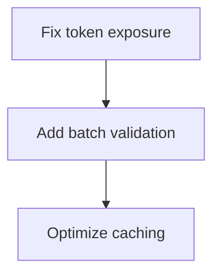

# Synthesis Agent: Final Report Compilation

## Mission
Compile all 5 agent reports into a comprehensive final analysis report with actionable recommendations.

## Scope
**Input:** 5 agent reports (categories 1-106)
**Expected Time:** 10-15 minutes
**Output:** `analysis-output/FINAL_ANALYSIS_REPORT.md`

## Input Files

```
analysis-output/category-reports/agent1-functional.md
analysis-output/category-reports/agent2-infrastructure.md
analysis-output/category-reports/agent3-advanced.md
analysis-output/category-reports/agent4-quality.md
analysis-output/category-reports/agent5-meta.md
```

## Tasks

### 1. Aggregate All Scores (10 minutes)

Read all 5 agent reports and extract:
- All 106 category scores
- Calculate total score: ΣΣ (category_score × weight)
- Calculate average score per category
- Identify highest and lowest scoring categories

Create master score matrix:

```markdown
| Category | Agent | Score | Weight | Weighted | Status |
|----------|-------|-------|--------|----------|--------|
| 1. Authentication | Agent 1 | X/10 | 5% | X | ✅/⚠️/❌ |
| ... | ... | ... | ... | ... | ... |
| **TOTAL** | - | **XXX/1060** | 100% | **XX%** | ... |
```

### 2. Aggregate All Issues (5 minutes)

Collect issues from all 5 reports and compile:

```markdown
## All Issues by Priority

### P0 - Critical (Must Fix Immediately)
1. **SEC-001** (Agent 1, Cat 1): Token exposure in logs
2. **FUNC-002** (Agent 1, Cat 2): Missing batch validation
...

### P1 - High Priority (Fix This Sprint)
...

### P2 - Medium Priority (Fix This Quarter)
...

### P3 - Low Priority (Backlog)
...
```

### 3. Create Dependency Graph (3 minutes)

Identify issue dependencies:

```markdown
## Issue Dependencies



### 4. Identify Top Strengths (2 minutes)

From all reports, identify top 10 strengths:

```markdown
## Top 10 Strengths

1. **Comprehensive MCP Protocol Support** (Cat 13: 9/10)
   - Full 2025-11-25 spec compliance
   - All 5 primitives implemented
   - Multiple SEP features

2. **Robust Testing** (Cat 24: 10/10)
   - 1,830+ tests
   - 85% coverage
   - 7 test types
...
```

### 5. Identify Top Gaps (2 minutes)

From all reports, identify top 10 gaps:

```markdown
## Top 10 Gaps

1. **BigQuery Integration Missing** (Cat 16: 0/10)
   - No Connected Sheets support
   - No data source management
   - Stretch goal, not critical

2. **Limited Dead Code Detection** (Cat 93: 4/10)
   - Manual detection only
   - No automated tooling
...
```

### 6. Create Implementation Roadmap (5 minutes)

Organize fixes into phases:

```markdown
## Implementation Roadmap

### Phase 1: Critical Fixes (Week 1-2)
**Goal:** Address all P0 issues

- [ ] SEC-001: Fix token exposure (2 days)
- [ ] FUNC-002: Add batch validation (3 days)
- [ ] MCP-001: Complete elicitation support (3 days)

**Effort:** 8 days
**Impact:** Resolves production blockers

### Phase 2: High Priority (Week 3-6)
**Goal:** Address all P1 issues

- [ ] PERF-001: Optimize caching (1 week)
- [ ] QUAL-001: Add missing tests (2 weeks)
- [ ] DOC-001: Update documentation (1 week)

**Effort:** 4 weeks
**Impact:** Improves reliability and UX

### Phase 3: Medium Priority (Month 2-3)
...

### Phase 4: Enhancements (Month 4+)
...
```

### 7. Calculate Metrics Summary (2 minutes)

```markdown
## Audit Metrics

### Execution
- **Total Time:** [duration]
- **Categories Analyzed:** 106/106 (100%)
- **Agents Deployed:** 5
- **Evidence Files:** [count]
- **Files Analyzed:** [count]
- **Lines of Code Reviewed:** [count]

### Findings
- **Total Score:** XXX/1060 (XX%)
- **Average Category Score:** X.X/10
- **Categories ≥8/10:** XX (XX%)
- **Categories <5/10:** XX (XX%)
- **P0 Issues:** X
- **P1 Issues:** X
- **P2 Issues:** X
- **P3 Issues:** X
```

### 8. Generate Executive Summary (3 minutes)

Write 2-3 paragraph executive summary covering:
- Overall health assessment
- Key strengths
- Critical issues
- Recommended immediate actions
- Long-term outlook

### 9. Quick Wins Analysis (2 minutes)

Identify low-effort, high-impact improvements:

```markdown
## Quick Wins (Low Effort, High Impact)

| Issue | Effort | Impact | Category | Priority |
|-------|--------|--------|----------|----------|
| DOC-003 | 2 hours | High | 26 | P1 |
| QUAL-002 | 4 hours | High | 24 | P1 |
| PERF-003 | 1 day | High | 32 | P2 |
```

## Final Report Structure

```markdown
# ServalSheets Comprehensive Audit Report

**Version:** 1.0
**Date:** [timestamp]
**Audit Framework:** MASTER_ANALYSIS_PROMPT v2.0.0
**Categories Analyzed:** 106
**Agents Deployed:** 5
**Execution Time:** [duration]

---

## Executive Summary

[2-3 paragraphs]

**Overall Score:** XXX/1060 (XX%)
**Status:** 🟢 Excellent / 🟡 Good / 🟠 Needs Work / 🔴 Critical

---

## Audit Metrics

[From task 7]

---

## Score Matrix

[From task 1 - complete 106-category table]

---

## Category Scores by Part

### Part 1: Functional Features (1-12)
**Score:** XX/120 (XX%)
**Status:** ✅ Strong

[Brief summary]

### Part 2: Technical Excellence (13-32)
**Score:** XX/200 (XX%)
**Status:** ⚠️ Needs attention

[Brief summary]

[Continue for all 6 parts]

---

## Top 10 Strengths

[From task 4]

---

## Top 10 Gaps

[From task 5]

---

## All Issues

[From task 2 - organized by priority]

---

## Quick Wins

[From task 9]

---

## Implementation Roadmap

[From task 6]

---

## Issue Dependency Graph

[From task 3]

---

## Evidence Summary

**Files Analyzed:** [count]
**Tests Reviewed:** [count]
**Commands Executed:** [count]

### Evidence Files
- ci.log - CI pipeline results
- tests-detailed.log - Detailed test output
- coverage.log - Coverage report
- typecheck.log - TypeScript validation
- lint.log - Linting results
- audit.json - Security audit
- build.log - Build output

### Agent Reports
- agent1-functional.md (Categories 1-21)
- agent2-infrastructure.md (Categories 22-42)
- agent3-advanced.md (Categories 43-63)
- agent4-quality.md (Categories 64-80)
- agent5-meta.md (Categories 81-106)

---

## Recommendations

### Immediate Actions (This Week)
1. [P0 issue 1]
2. [P0 issue 2]

### Short-Term (This Month)
1. [P1 issue 1]
2. [P1 issue 2]

### Long-Term (This Quarter)
1. [P2 issue 1]
2. [P2 issue 2]

---

## Conclusion

[1 paragraph final assessment]

---

**Audit Completed By:** Synthesis Agent
**Framework Version:** MASTER_ANALYSIS_PROMPT v2.0.0
**Report Generated:** [timestamp]
```

## Validation Checklist

Before finalizing, verify:

- [ ] All 106 categories have scores
- [ ] All scores are evidence-based (file references)
- [ ] All issues are classified (P0-P3, type)
- [ ] Roadmap is actionable with effort estimates
- [ ] Executive summary is accurate
- [ ] No contradictions between agent reports
- [ ] All evidence files referenced
- [ ] Report is well-formatted markdown

## Start Synthesis Now

Begin by reading all 5 agent reports and extracting scores.
