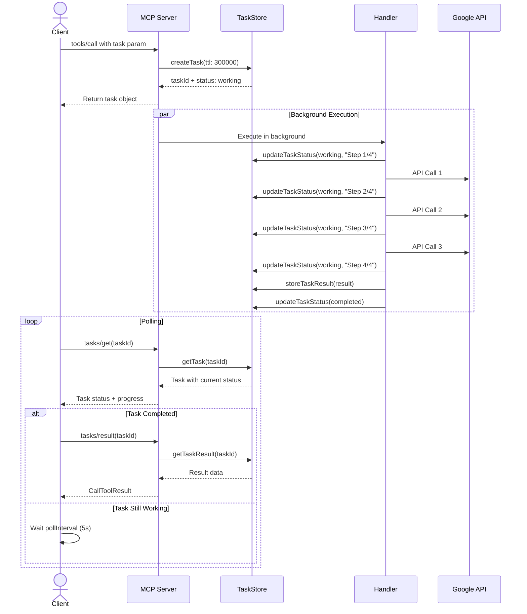

# ServalSheets Architecture Diagrams

This document contains comprehensive architecture diagrams for ServalSheets using Mermaid syntax.

---

## System Architecture Overview

High-level overview of ServalSheets components and their relationships.


---

## MCP Protocol Flow

How MCP protocol requests flow through the system.


---

## Request Processing Pipeline

Detailed request processing flow including middleware, validation, and error handling.


---

## Handler Architecture

How handlers are structured and loaded dynamically.


---

## OAuth Authentication Flow

Complete OAuth 2.1 flow with PKCE.


---

## Data Flow Diagram

How data flows through ServalSheets when processing a spreadsheet operation.


---

## Task System Architecture

How long-running operations are handled via task system.




---

## Deployment Architecture Options

### Option 1: Single Server Deployment


### Option 2: Load Balanced Deployment


### Option 3: Kubernetes Deployment

```mermaid
graph TB
    subgraph "Kubernetes Cluster"
        subgraph "Ingress"
            Ingress[Ingress Controller<br/>cert-manager for TLS]
        end

        subgraph "Application Namespace"
            Deployment[Deployment<br/>ServalSheets<br/>replicas: 3-20]
            HPA[HorizontalPodAutoscaler<br/>CPU/Memory based]
            Service[Service<br/>ClusterIP]
        end

        subgraph "Storage"
            Redis[(Redis StatefulSet<br/>or External Redis)]
            PVC[PersistentVolumeClaim<br/>for configs]
        end

        subgraph "Secrets"
            TLS[TLS Certificate]
            Creds[OAuth Credentials]
            TokenKey[Token Store Key]
        end
    end

    subgraph "External"
        Users[Clients]
        Google[Google APIs]
    end

    Users --> Ingress
    Ingress --> Service
    Service --> Deployment
    HPA --> Deployment
    Deployment --> Redis
    Deployment --> PVC
    Deployment --> Creds & TokenKey
    Deployment --> Google
    Ingress --> TLS

    style Ingress fill:#b39ddb
    style Deployment fill:#e1f5ff
    style Redis fill:#ffebee
    style HPA fill:#c5e1a5
```

---

## Error Handling Flow

How errors are caught, structured, and returned to clients.


---

## Component Interaction Matrix

Summary of how major components interact.


---

## Notes

All diagrams are rendered using Mermaid syntax and can be viewed in:
- GitHub (native support)
- GitLab (native support)
- VS Code (with Mermaid extension)
- Documentation sites (Docsify, MkDocs, etc.)
- Mermaid Live Editor: https://mermaid.live

To update diagrams, edit the Mermaid code blocks and the rendered output will update automatically in supported viewers.
