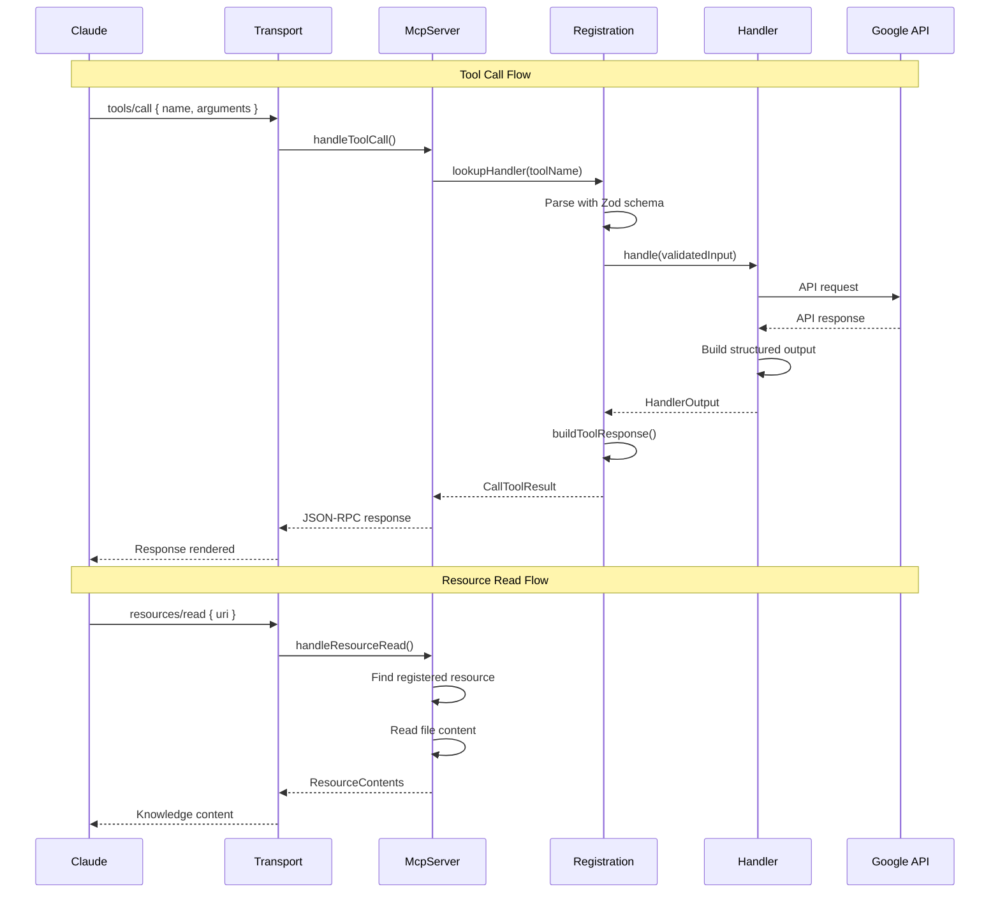
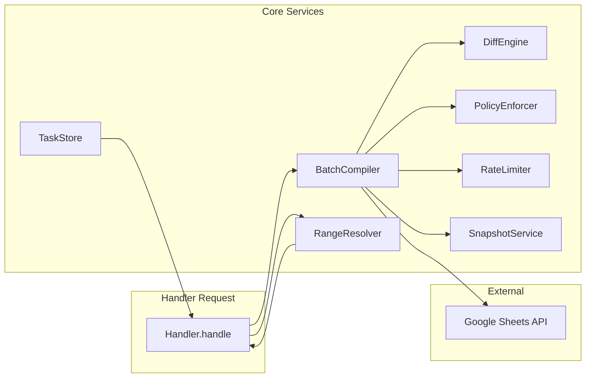
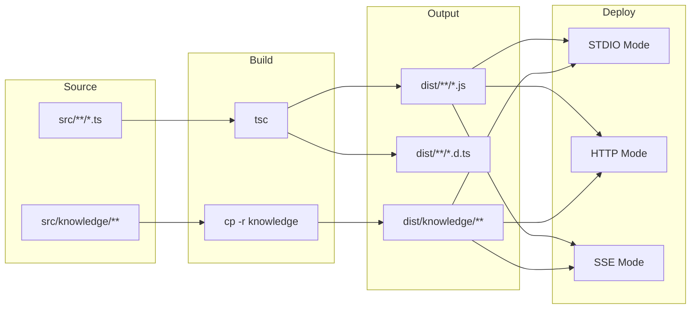

# ServalSheets Complete Project Traceability

> **Version:** 1.2.0 (Corrected)  
> **Generated:** January 5, 2026  
> **Status:** ✅ Verified Against Source Code

---

## Quick Stats

```
┌─────────────────────────────────────────────────────────────────────┐
│  ServalSheets v1.2.0 - MCP 2025-11-25 Compliant                     │
├─────────────────────────────────────────────────────────────────────┤
│  Tools:     16 (15 domain + 1 auth)                                 │
│  Actions:   165 (discriminated union patterns)                      │
│  Resources: 14 (knowledge files)                                    │
│  Handlers:  16 (lazy-loaded domain handlers)                        │
│  Core:      9 service modules                                       │
│  Schemas:   16 tool schemas + shared + annotations                  │
└─────────────────────────────────────────────────────────────────────┘
```

---

## Master Architecture Diagram

```mermaid
graph TB
    subgraph "Client Layer"
        CLAUDE[Claude Desktop<br/>or MCP Client]
    end

    subgraph "Transport Layer"
        STDIO[STDIO Transport<br/>JSON-RPC 2.0]
        HTTP[HTTP Server<br/>Express + Compression]
        SSE[SSE Server<br/>Server-Sent Events]
    end

    subgraph "MCP Server Layer"
        MCPS[McpServer<br/>@modelcontextprotocol/sdk]
        CAP[Capabilities<br/>features-2025-11-25.ts]
        TASK[TaskStore<br/>SEP-1686]
    end

    subgraph "Registration Layer"
        REG[registration.ts<br/>16 Tools]
        TOOLS[Tool Definitions<br/>Schemas + Annotations]
        HMAP[Handler Map<br/>Lazy Proxy]
    end

    subgraph "Schema Layer"
        SHARED[shared.ts<br/>Common Types]
        ANNO[annotations.ts<br/>64 Hints]
        COMPAT[schema-compat.ts<br/>SDK Compatibility]
    end

    subgraph "Handler Layer"
        AUTH[AuthHandler]
        H1[SpreadsheetHandler]
        H2[SheetHandler]
        H3[ValuesHandler]
        H4[CellsHandler]
        H5[FormatHandler]
        H6[DimensionsHandler]
        H7[RulesHandler]
        H8[ChartsHandler]
        H9[PivotHandler]
        H10[FilterSortHandler]
        H11[SharingHandler]
        H12[CommentsHandler]
        H13[VersionsHandler]
        H14[AnalysisHandler]
        H15[AdvancedHandler]
    end

    subgraph "Core Services"
        BATCH[BatchCompiler]
        DIFF[DiffEngine]
        RANGE[RangeResolver]
        POLICY[PolicyEnforcer]
        RATE[RateLimiter]
        SNAP[SnapshotService]
    end

    subgraph "External APIs"
        SHEETS[Google Sheets API v4]
        DRIVE[Google Drive API v3]
        OAUTH[Google OAuth 2.1]
    end

    subgraph "Resources"
        KNOW[Knowledge Resources<br/>14 files]
        TOKEN[TokenStore<br/>Encrypted Storage]
    end

    CLAUDE --> STDIO
    CLAUDE --> HTTP
    CLAUDE --> SSE
    
    STDIO --> MCPS
    HTTP --> MCPS
    SSE --> MCPS
    
    MCPS --> CAP
    MCPS --> TASK
    MCPS --> REG
    MCPS --> KNOW
    
    REG --> TOOLS
    REG --> HMAP
    TOOLS --> SHARED
    TOOLS --> ANNO
    TOOLS --> COMPAT
    
    HMAP --> AUTH
    HMAP --> H1
    HMAP --> H2
    HMAP --> H3
    HMAP --> H4
    HMAP --> H5
    HMAP --> H6
    HMAP --> H7
    HMAP --> H8
    HMAP --> H9
    HMAP --> H10
    HMAP --> H11
    HMAP --> H12
    HMAP --> H13
    HMAP --> H14
    HMAP --> H15
    
    AUTH --> OAUTH
    AUTH --> TOKEN
    
    H1 --> BATCH
    H3 --> BATCH
    BATCH --> DIFF
    BATCH --> POLICY
    BATCH --> RATE
    BATCH --> SNAP
    
    H3 --> RANGE
    
    H1 --> SHEETS
    H2 --> SHEETS
    H3 --> SHEETS
    H4 --> SHEETS
    H5 --> SHEETS
    H6 --> SHEETS
    H7 --> SHEETS
    H8 --> SHEETS
    H9 --> SHEETS
    H10 --> SHEETS
    H14 --> SHEETS
    H15 --> SHEETS
    
    H11 --> DRIVE
    H12 --> DRIVE
    H13 --> DRIVE
```

---

## File Dependency Tree

```
servalsheets/
├── 📄 package.json ─────────────────────────► npm scripts, dependencies
├── 📄 tsconfig.json ────────────────────────► TypeScript configuration
├── 📄 .env ─────────────────────────────────► OAuth credentials
│
├── 📁 src/
│   ├── 📄 server.ts ────────────────────────► Main server class
│   │   ├── imports: mcp/registration.ts
│   │   ├── imports: resources/knowledge.ts
│   │   ├── imports: handlers/index.ts
│   │   └── imports: core/task-store.ts
│   │
│   ├── 📄 cli.ts ───────────────────────────► CLI entry point
│   │   └── imports: server.ts
│   │
│   ├── 📄 http-server.ts ───────────────────► HTTP mode
│   │   └── imports: server.ts
│   │
│   ├── 📄 remote-server.ts ─────────────────► SSE mode
│   │   └── imports: server.ts
│   │
│   ├── 📁 mcp/
│   │   ├── 📄 registration.ts ──────────────► Tool registration (903 lines)
│   │   │   ├── imports: schemas/*.ts (all 16)
│   │   │   ├── imports: utils/schema-compat.ts
│   │   │   └── exports: TOOL_DEFINITIONS, createToolHandlerMap
│   │   │
│   │   ├── 📄 features-2025-11-25.ts ───────► Capabilities
│   │   ├── 📄 sampling.ts ──────────────────► SEP-1577
│   │   ├── 📄 elicitation.ts ───────────────► SEP-1036
│   │   ├── 📄 completions.ts ───────────────► Argument completion
│   │   └── 📄 sdk-compat.ts ────────────────► SDK compatibility
│   │
│   ├── 📁 schemas/
│   │   ├── 📄 shared.ts ────────────────────► Common types (556 lines)
│   │   │   └── exports: ColorSchema, RangeInputSchema, SafetyOptionsSchema
│   │   │
│   │   ├── 📄 annotations.ts ───────────────► Tool hints (199 lines)
│   │   │   └── exports: TOOL_ANNOTATIONS, ACTION_COUNTS
│   │   │
│   │   ├── 📄 auth.ts ──────────────────────► 4 actions
│   │   ├── 📄 spreadsheet.ts ───────────────► 6 actions
│   │   ├── 📄 sheet.ts ─────────────────────► 7 actions
│   │   ├── 📄 values.ts ────────────────────► 9 actions
│   │   ├── 📄 cells.ts ─────────────────────► 12 actions
│   │   ├── 📄 format.ts ────────────────────► 9 actions
│   │   ├── 📄 dimensions.ts ────────────────► 21 actions
│   │   ├── 📄 rules.ts ─────────────────────► 8 actions
│   │   ├── 📄 charts.ts ────────────────────► 9 actions
│   │   ├── 📄 pivot.ts ─────────────────────► 6 actions
│   │   ├── 📄 filter-sort.ts ───────────────► 14 actions
│   │   ├── 📄 sharing.ts ───────────────────► 8 actions
│   │   ├── 📄 comments.ts ──────────────────► 10 actions
│   │   ├── 📄 versions.ts ──────────────────► 10 actions
│   │   ├── 📄 analysis.ts ──────────────────► 13 actions ⭐
│   │   ├── 📄 advanced.ts ──────────────────► 19 actions
│   │   └── 📄 index.ts ─────────────────────► Re-exports
│   │
│   ├── 📁 handlers/
│   │   ├── 📄 base.ts ──────────────────────► BaseHandler class
│   │   ├── 📄 index.ts ─────────────────────► Lazy-loading factory
│   │   └── 📄 [16 domain handlers] ─────────► Tool implementations
│   │
│   ├── 📁 core/
│   │   ├── 📄 batch-compiler.ts ────────────► API call batching
│   │   ├── 📄 diff-engine.ts ───────────────► Change detection
│   │   ├── 📄 policy-enforcer.ts ───────────► Safety rails
│   │   ├── 📄 range-resolver.ts ────────────► Semantic → A1
│   │   ├── 📄 rate-limiter.ts ──────────────► API rate limiting
│   │   ├── 📄 task-store.ts ────────────────► In-memory tasks
│   │   ├── 📄 task-store-adapter.ts ────────► MCP SDK adapter
│   │   ├── 📄 task-store-factory.ts ────────► Factory pattern
│   │   ├── 📄 intent.ts ────────────────────► Intent classification
│   │   ├── 📄 errors.ts ────────────────────► Custom errors
│   │   └── 📄 index.ts ─────────────────────► Re-exports
│   │
│   ├── 📁 resources/
│   │   ├── 📄 index.ts ─────────────────────► Resource exports
│   │   └── 📄 knowledge.ts ─────────────────► Knowledge loader
│   │
│   ├── 📁 knowledge/
│   │   ├── 📄 README.md
│   │   ├── 📄 DELIVERABLES.md
│   │   ├── 📁 api/ (7 files)
│   │   │   ├── charts.md
│   │   │   ├── pivot-tables.md
│   │   │   ├── conditional-formatting.md
│   │   │   ├── data-validation.md
│   │   │   ├── batch-operations.md
│   │   │   ├── named-ranges.md
│   │   │   └── limits/quotas.json
│   │   ├── 📁 formulas/ (4 files)
│   │   │   ├── functions-reference.md
│   │   │   ├── financial.json
│   │   │   ├── lookup.json
│   │   │   └── key-formulas.json
│   │   └── 📁 templates/ (1 file)
│   │       └── common-templates.json
│   │
│   ├── 📁 services/
│   │   ├── 📄 google-api.ts ────────────────► API client factory
│   │   ├── 📄 snapshot.ts ──────────────────► Backup/restore
│   │   └── 📄 token-store.ts ───────────────► OAuth token storage
│   │
│   ├── 📁 utils/
│   │   ├── 📄 schema-compat.ts ─────────────► Zod → JSON Schema
│   │   ├── 📄 logger.ts ────────────────────► Winston logger
│   │   ├── 📄 auth-guard.ts ────────────────► Auth middleware
│   │   └── 📄 [16 more utilities]
│   │
│   └── 📁 storage/
│       └── 📄 token-storage.ts ─────────────► Token encryption
│
└── 📁 dist/ ─────────────────────────────────► Build output
    ├── 📄 cli.js ───────────────────────────► Compiled CLI
    ├── 📁 knowledge/ ───────────────────────► Copied assets
    └── 📄 [all .js + .d.ts files]
```

---

## Tool → Actions Matrix

| Tool (16 total) | Actions | API Used |
|-----------------|:-------:|----------|
| `sheets_auth` | 4 | OAuth 2.1 |
| `sheets_spreadsheet` | 6 | Sheets API |
| `sheets_sheet` | 7 | Sheets API |
| `sheets_values` | 9 | Sheets API |
| `sheets_cells` | 12 | Sheets API |
| `sheets_format` | 9 | Sheets API |
| `sheets_dimensions` | 21 | Sheets API |
| `sheets_rules` | 8 | Sheets API |
| `sheets_charts` | 9 | Sheets API |
| `sheets_pivot` | 6 | Sheets API |
| `sheets_filter_sort` | 14 | Sheets API |
| `sheets_sharing` | 8 | Drive API |
| `sheets_comments` | 10 | Drive API |
| `sheets_versions` | 10 | Drive API |
| `sheets_analysis` | **13** | Sheets API (read-only) |
| `sheets_advanced` | 19 | Sheets API |
| **TOTAL** | **165** | |

---

## Request Flow Sequence



---

## Knowledge Resource URIs

| # | URI | Category | Description |
|---|-----|----------|-------------|
| 1 | `knowledge:///README.md` | root | Knowledge base overview |
| 2 | `knowledge:///DELIVERABLES.md` | root | Project deliverables |
| 3 | `knowledge:///api/charts.md` | api | Chart creation patterns |
| 4 | `knowledge:///api/pivot-tables.md` | api | Pivot table patterns |
| 5 | `knowledge:///api/conditional-formatting.md` | api | Formatting rules |
| 6 | `knowledge:///api/data-validation.md` | api | Validation patterns |
| 7 | `knowledge:///api/batch-operations.md` | api | Batching strategies |
| 8 | `knowledge:///api/named-ranges.md` | api | Named range patterns |
| 9 | `knowledge:///api/limits/quotas.json` | api/limits | API quotas |
| 10 | `knowledge:///formulas/functions-reference.md` | formulas | Function reference |
| 11 | `knowledge:///formulas/financial.json` | formulas | Financial formulas |
| 12 | `knowledge:///formulas/lookup.json` | formulas | Lookup formulas |
| 13 | `knowledge:///formulas/key-formulas.json` | formulas | Key formulas |
| 14 | `knowledge:///templates/common-templates.json` | templates | Template library |

---

## Core Services Dependency



---

## Build Pipeline



### Build Commands

| Command | Description |
|---------|-------------|
| `npm run build` | TypeScript compile + copy knowledge |
| `npm run build:clean` | Clean rebuild |
| `npm run verify:build` | Build + test CLI |
| `npm run start` | Run STDIO mode |
| `npm run start:http` | Run HTTP server |
| `npm run start:remote` | Run SSE server |

---

## Verification Checklist

| Check | Status | Evidence |
|-------|--------|----------|
| Tool names SEP-986 | ✅ | `/^[A-Za-z0-9._-]{1,128}$/` |
| All 4 annotations | ✅ | 16 × 4 = 64 hints |
| Dual response format | ✅ | content[] + structuredContent |
| Color 0-1 scale | ✅ | ColorSchema.max(1) |
| Schema z.object root | ✅ | All 16 input/output schemas |
| Knowledge loads | ✅ | 14 resources registered |
| Handlers lazy-load | ✅ | Proxy pattern in index.ts |
| Task support | ✅ | TaskStoreAdapter |
| OAuth encrypted | ✅ | AES-256-GCM |

---

*Document verified against source code: January 5, 2026*
